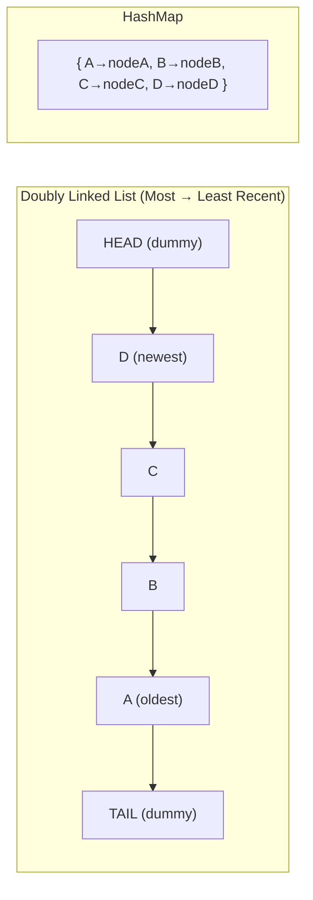
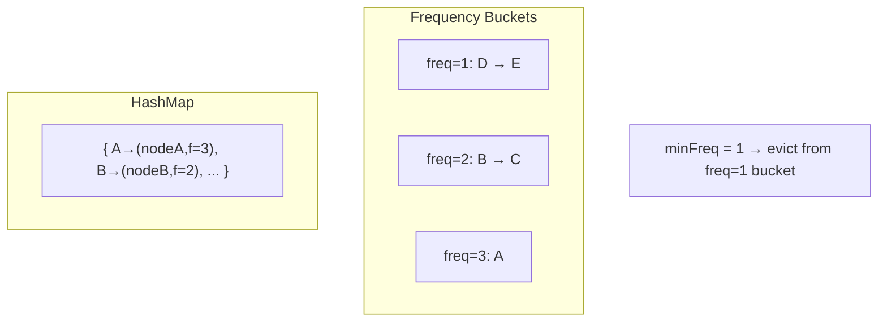
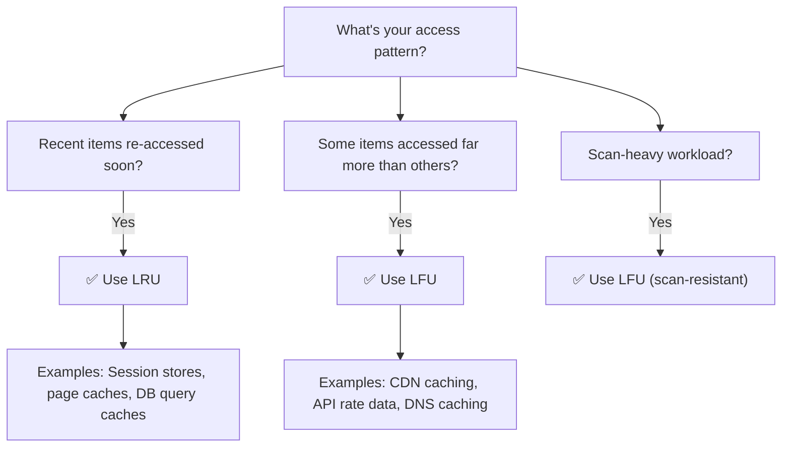
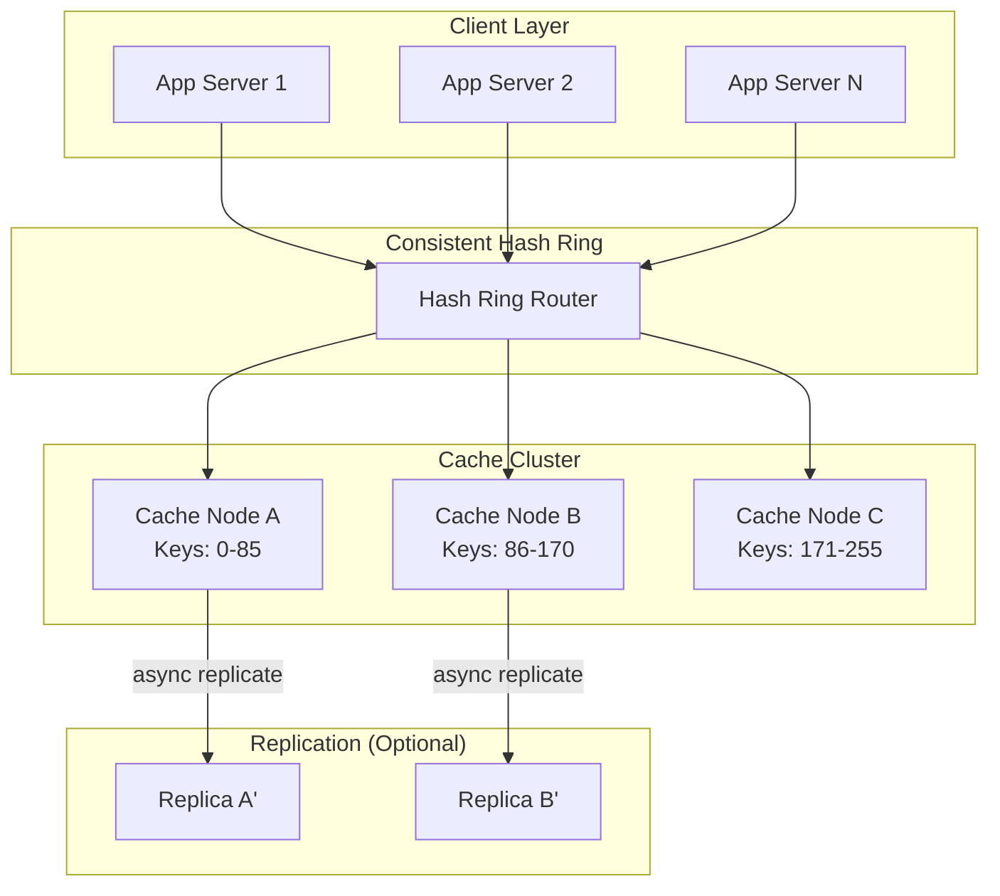
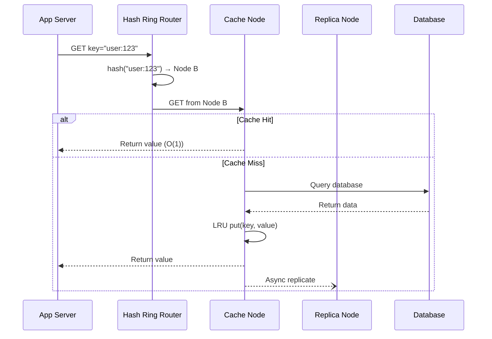

# 🎯 LRU & LFU Cache: Eviction Algorithms, Applications & Distributed Caching

**Target Level:** Junior → Senior → Staff Engineer
**Duration:** 60-75 minutes
**Interview Focus:** Cache eviction strategies, O(1) data structure design, distributed systems

> **Interview Importance:** 🔴 Critical — LRU Cache is the #1 most-asked data structure problem in FAANG interviews. LFU and distributed caching appear in every system design round. Understanding these is non-negotiable for senior+ roles.

---

## 1️⃣ What is Caching and Why Do We Need Eviction?

A **cache** is a fast, limited-size storage layer that keeps frequently or recently used data close to the consumer, avoiding expensive recomputation or network calls.

**The Problem:** Caches have finite memory. When full, we must decide **which item to remove** — this is the **eviction policy**.

```
┌──────────────────────────────────────────────────────┐
│                    Cache (limited)                     │
│                                                        │
│   ┌───┐  ┌───┐  ┌───┐  ┌───┐  ┌───┐                  │
│   │ A │  │ B │  │ C │  │ D │  │ E │   ← Cache full!   │
│   └───┘  └───┘  └───┘  └───┘  └───┘                   │
│                                                        │
│   New item F arrives → WHO gets evicted?               │
│                                                        │
│   LRU says: "Evict whoever was used LEAST RECENTLY"    │
│   LFU says: "Evict whoever was used LEAST FREQUENTLY"  │
└──────────────────────────────────────────────────────┘
```

**Real-World Analogy:**

- **LRU** = Your browser tabs. The tab you haven't switched to in the longest time gets closed first when memory runs low.
- **LFU** = Your phone's app suggestions. Apps you rarely open get removed from quick-access, even if you used one yesterday by accident.

---

## 2️⃣ LRU Cache (Least Recently Used)

### 🧠 Core Idea

Evict the item that was **accessed longest ago**. Every `get` or `put` marks an item as "just used" and moves it to the front. The item at the back is the eviction candidate.

### How It Works



**Two data structures working together:**

| Structure | Purpose | Time Complexity |
|-----------|---------|-----------------|
| **HashMap** | O(1) key lookup to find nodes | O(1) get/put |
| **Doubly Linked List** | O(1) insertion/deletion to track recency order | O(1) move/remove |

### 📄 Implementation

```javascript
class Node {
  constructor(key, value) {
    this.key = key;
    this.value = value;
    this.prev = null;
    this.next = null;
  }
}

class LRUCache {
  constructor(capacity) {
    this.capacity = capacity;
    this.map = new Map();

    // Dummy head and tail to avoid null checks
    this.head = new Node(0, 0);
    this.tail = new Node(0, 0);
    this.head.next = this.tail;
    this.tail.prev = this.head;
  }

  // Move node right after head (most recently used position)
  _moveToHead(node) {
    this._removeNode(node);
    this._addToHead(node);
  }

  _addToHead(node) {
    node.prev = this.head;
    node.next = this.head.next;
    this.head.next.prev = node;
    this.head.next = node;
  }

  _removeNode(node) {
    node.prev.next = node.next;
    node.next.prev = node.prev;
  }

  // Remove and return the node just before tail (least recently used)
  _popTail() {
    const node = this.tail.prev;
    this._removeNode(node);
    return node;
  }

  get(key) {
    if (!this.map.has(key)) return -1;

    const node = this.map.get(key);
    this._moveToHead(node); // Mark as recently used
    return node.value;
  }

  put(key, value) {
    if (this.map.has(key)) {
      const node = this.map.get(key);
      node.value = value;
      this._moveToHead(node);
      return;
    }

    const newNode = new Node(key, value);
    this.map.set(key, newNode);
    this._addToHead(newNode);

    if (this.map.size > this.capacity) {
      const evicted = this._popTail();
      this.map.delete(evicted.key);
    }
  }
}
```

### 🔍 Dry Run

```
LRUCache(3) — capacity = 3

Operation          List (Head→Tail)       Map                    Result
─────────────────────────────────────────────────────────────────────────
put(1, "A")        [1:A]                  {1→node}               —
put(2, "B")        [2:B, 1:A]             {1→node, 2→node}       —
put(3, "C")        [3:C, 2:B, 1:A]        {1→node, 2→node, 3→n} —
get(1)             [1:A, 3:C, 2:B]        {1→node, 2→node, 3→n} "A"
                    ↑ 1 moved to head
put(4, "D")        [4:D, 1:A, 3:C]        {1→node, 3→node, 4→n} —
                    ↑ 2:B evicted (LRU)     key 2 deleted
get(2)             [4:D, 1:A, 3:C]        {1→node, 3→node, 4→n} -1 (miss!)
```

### ⏱️ Complexity

| Operation | Time | Space |
|-----------|------|-------|
| `get(key)` | O(1) | — |
| `put(key, value)` | O(1) | — |
| Overall space | — | O(capacity) |

---

## 3️⃣ LFU Cache (Least Frequently Used)

### 🧠 Core Idea

Evict the item with the **lowest access count**. If there's a tie, evict the **least recently used** among them (LRU as tiebreaker).

### How It Works



**Three data structures:**

| Structure | Purpose |
|-----------|---------|
| **keyMap** (HashMap) | Key → Node (with value + frequency) |
| **freqMap** (HashMap) | Frequency → Doubly Linked List of nodes at that frequency |
| **minFreq** (integer) | Tracks the current minimum frequency for O(1) eviction |

### 📄 Implementation

```javascript
class LFUNode {
  constructor(key, value) {
    this.key = key;
    this.value = value;
    this.freq = 1;
    this.prev = null;
    this.next = null;
  }
}

class DoublyLinkedList {
  constructor() {
    this.head = new LFUNode(0, 0);
    this.tail = new LFUNode(0, 0);
    this.head.next = this.tail;
    this.tail.prev = this.head;
    this.size = 0;
  }

  addToHead(node) {
    node.prev = this.head;
    node.next = this.head.next;
    this.head.next.prev = node;
    this.head.next = node;
    this.size++;
  }

  removeNode(node) {
    node.prev.next = node.next;
    node.next.prev = node.prev;
    this.size--;
  }

  removeTail() {
    if (this.size === 0) return null;
    const node = this.tail.prev;
    this.removeNode(node);
    return node;
  }
}

class LFUCache {
  constructor(capacity) {
    this.capacity = capacity;
    this.keyMap = new Map();   // key → LFUNode
    this.freqMap = new Map();  // freq → DoublyLinkedList
    this.minFreq = 0;
  }

  _getFreqList(freq) {
    if (!this.freqMap.has(freq)) {
      this.freqMap.set(freq, new DoublyLinkedList());
    }
    return this.freqMap.get(freq);
  }

  // Bump a node's frequency: remove from old list, add to new list
  _updateFreq(node) {
    const oldFreq = node.freq;
    const oldList = this.freqMap.get(oldFreq);
    oldList.removeNode(node);

    // If old frequency list is now empty and was the minimum, bump minFreq
    if (oldList.size === 0) {
      this.freqMap.delete(oldFreq);
      if (this.minFreq === oldFreq) this.minFreq++;
    }

    node.freq++;
    const newList = this._getFreqList(node.freq);
    newList.addToHead(node);
  }

  get(key) {
    if (!this.keyMap.has(key)) return -1;

    const node = this.keyMap.get(key);
    this._updateFreq(node); // Increase access frequency
    return node.value;
  }

  put(key, value) {
    if (this.capacity === 0) return;

    if (this.keyMap.has(key)) {
      const node = this.keyMap.get(key);
      node.value = value;
      this._updateFreq(node);
      return;
    }

    // Evict if at capacity
    if (this.keyMap.size >= this.capacity) {
      const minList = this.freqMap.get(this.minFreq);
      const evicted = minList.removeTail(); // LRU among min-freq items
      this.keyMap.delete(evicted.key);
      if (minList.size === 0) this.freqMap.delete(this.minFreq);
    }

    const newNode = new LFUNode(key, value);
    this.keyMap.set(key, newNode);
    const freqOneList = this._getFreqList(1);
    freqOneList.addToHead(newNode);
    this.minFreq = 1; // New node always starts at freq=1
  }
}
```

### 🔍 Dry Run

```
LFUCache(3) — capacity = 3

Operation    keyMap                      freqMap                    minFreq  Result
─────────────────────────────────────────────────────────────────────────────────────
put(1,"A")   {1→(A,f=1)}                 {1: [1]}                   1        —
put(2,"B")   {1→(A,f=1), 2→(B,f=1)}     {1: [2,1]}                 1        —
put(3,"C")   {1,2,3}                     {1: [3,2,1]}               1        —
get(1)       {1→(A,f=2), 2,3}           {1: [3,2], 2: [1]}         1        "A"
             ↑ freq bumped to 2
get(2)       {1→f=2, 2→f=2, 3→f=1}     {1: [3], 2: [2,1]}         1        "B"
put(4,"D")   {1→f=2, 2→f=2, 4→f=1}     {1: [4], 2: [2,1]}         1        —
             ↑ key=3 evicted (freq=1, LRU in that bucket)
get(3)       —                           —                          —        -1 (miss!)
```

---

## 4️⃣ LRU vs LFU: Head-to-Head Comparison

| Aspect | LRU | LFU |
|--------|-----|-----|
| **Eviction criterion** | Least recently accessed | Least frequently accessed |
| **Best for** | Temporal locality (recent = likely needed again) | Frequency-based access patterns |
| **Time complexity** | O(1) get/put | O(1) get/put |
| **Space complexity** | O(n) — HashMap + DLL | O(n) — 2 HashMaps + multiple DLLs |
| **Implementation** | Simpler (1 HashMap + 1 DLL) | More complex (2 HashMaps + freq buckets) |
| **Cache pollution** | Vulnerable to sequential scans | Resistant to one-off accesses |
| **Cold-start problem** | No issue | New items start at freq=1, easily evicted |
| **Stale data risk** | Low — old items naturally evicted | High — popular-but-stale items persist |
| **Real-world use** | Redis, Memcached, OS page cache | CDN edge caching, DNS resolvers |

### When to Use Which?



---

## 5️⃣ Real-World Applications

### 🟢 Frontend Applications

```javascript
// 1. API Response Cache — Avoid redundant network calls
const apiCache = new LRUCache(50);

const fetchWithCache = async (url) => {
  const cached = apiCache.get(url);
  if (cached !== -1) return cached;

  const response = await fetch(url);
  const data = await response.json();
  apiCache.put(url, data);
  return data;
};

// 2. Image/Asset Preloading Cache
const imageCache = new LRUCache(100);

const loadImage = (src) => {
  if (imageCache.get(src) !== -1) return imageCache.get(src);

  const img = new Image();
  img.src = src;
  imageCache.put(src, img);
  return img;
};

// 3. React Component Memoization (conceptually how React.memo works)
const renderCache = new LRUCache(200);

const memoizedRender = (componentKey, props) => {
  const cacheKey = `${componentKey}:${JSON.stringify(props)}`;
  const cached = renderCache.get(cacheKey);
  if (cached !== -1) return cached;

  const result = expensiveRender(componentKey, props);
  renderCache.put(cacheKey, result);
  return result;
};
```

### 🟡 Backend Applications

| Application | Cache Type | Why |
|-------------|-----------|-----|
| **Redis** | Approximate LRU/LFU (sampling) | Fast eviction without global recency bookkeeping |
| **Database query cache** | LRU | Recent queries likely repeated |
| **CDN edge servers** | LFU | Popular assets should persist |
| **DNS resolvers** | LFU | Frequently queried domains stay cached |
| **OS page/buffer cache** | LRU variant (Clock) | Recently accessed pages likely re-accessed |
| **CPU L1/L2/L3 cache** | LRU approximation | Hardware-level temporal locality |
| **Connection pools** | LRU | Recycle idle connections |

### 🔴 System Design Applications

- **URL Shortener** — Cache hot short→long URL mappings
- **Rate Limiter** — Track request counts per user (LFU-style frequency tracking)
- **News Feed** — Cache computed feeds for active users (LRU)
- **Search Autocomplete** — Cache popular prefix results (LFU)

---

## 6️⃣ Stage 2: Senior Level — Production Hardening

### TTL (Time-To-Live) Support

Real caches expire stale data. Here's LRU with TTL:

```javascript
class LRUCacheWithTTL extends LRUCache {
  constructor(capacity, defaultTTL = 60000) {
    super(capacity);
    this.defaultTTL = defaultTTL;
  }

  put(key, value, ttl = this.defaultTTL) {
    super.put(key, value);
    const node = this.map.get(key);
    node.expiry = Date.now() + ttl;
  }

  get(key) {
    if (!this.map.has(key)) return -1;

    const node = this.map.get(key);

    // Check expiry before returning
    if (node.expiry && Date.now() > node.expiry) {
      this._removeNode(node);
      this.map.delete(key);
      return -1;
    }

    this._moveToHead(node);
    return node.value;
  }
}
```

### Thread-Safe LRU (Conceptual)

In multi-threaded environments (not JS, but critical for system design interviews):

```javascript
// Conceptual — JavaScript is single-threaded, but this pattern matters
// for system design discussions involving Java/Go/C++ caches

class ThreadSafeLRUCache {
  constructor(capacity, shardCount = 16) {
    // Shard the cache to reduce lock contention
    this.shards = Array.from(
      { length: shardCount },
      () => new LRUCache(Math.ceil(capacity / shardCount))
    );
    this.shardCount = shardCount;
  }

  _getShard(key) {
    // Simple hash to distribute keys across shards
    const hash = [...String(key)].reduce((h, c) => (h * 31 + c.charCodeAt(0)) | 0, 0);
    return this.shards[Math.abs(hash) % this.shardCount];
  }

  get(key) {
    return this._getShard(key).get(key);
  }

  put(key, value) {
    this._getShard(key).put(key, value);
  }
}
```

---

## 7️⃣ Stage 3: Staff Level — Distributed LRU Cache

### Why Distribute?

Single-node caches hit limits:

| Limit | Solution |
|-------|----------|
| **Memory ceiling** | Spread data across multiple nodes |
| **Single point of failure** | Replication for availability |
| **Network latency** | Place caches near users (geo-distribution) |
| **Hot key bottleneck** | Shard hot keys across replicas |

### Architecture: Distributed Cache



### Consistent Hashing: The Key to Distribution

When nodes join or leave, **consistent hashing** minimizes key redistribution.

```javascript
class ConsistentHashRing {
  constructor(nodes = [], virtualNodes = 150) {
    this.ring = new Map();       // hash position → node
    this.sortedKeys = [];        // sorted hash positions
    this.virtualNodes = virtualNodes;

    nodes.forEach((node) => this.addNode(node));
  }

  _hash(key) {
    let hash = 0;
    for (let i = 0; i < key.length; i++) {
      hash = ((hash << 5) - hash + key.charCodeAt(i)) | 0;
    }
    return Math.abs(hash);
  }

  addNode(node) {
    // Virtual nodes spread each physical node across the ring
    for (let i = 0; i < this.virtualNodes; i++) {
      const virtualKey = `${node}#${i}`;
      const hash = this._hash(virtualKey);
      this.ring.set(hash, node);
      this.sortedKeys.push(hash);
    }
    this.sortedKeys.sort((a, b) => a - b);
  }

  removeNode(node) {
    for (let i = 0; i < this.virtualNodes; i++) {
      const hash = this._hash(`${node}#${i}`);
      this.ring.delete(hash);
      this.sortedKeys = this.sortedKeys.filter((k) => k !== hash);
    }
  }

  // Find which node owns a given key
  getNode(key) {
    if (this.sortedKeys.length === 0) return null;

    const hash = this._hash(key);
    // Find the first node position >= hash (clockwise on the ring)
    for (const pos of this.sortedKeys) {
      if (pos >= hash) return this.ring.get(pos);
    }
    return this.ring.get(this.sortedKeys[0]); // Wrap around
  }
}

// Usage
const ring = new ConsistentHashRing(["cache-1", "cache-2", "cache-3"]);
console.log(ring.getNode("user:1234"));  // → "cache-2"
console.log(ring.getNode("session:567")); // → "cache-1"

// Adding a node only moves ~1/N keys
ring.addNode("cache-4");
```

### Distributed LRU: Complete Design



### Key Design Decisions

| Decision | Option A | Option B | Recommendation |
|----------|----------|----------|----------------|
| **Partitioning** | Range-based | Consistent hashing | **Consistent hashing** — uniform distribution, graceful scaling |
| **Replication** | Synchronous | Asynchronous | **Async** — lower latency; accept brief inconsistency |
| **Eviction scope** | Global LRU | Per-node LRU | **Per-node** — simpler, no cross-node coordination |
| **Cache-aside vs Write-through** | App manages cache | Cache writes to DB | **Cache-aside** — more flexible, app controls invalidation |
| **Hot key handling** | Single node | Replicate to N nodes | **Replicate hot keys** — distribute read load |

### Handling Failures

```
Node failure detected (heartbeat timeout):

  ┌─────────────────────────────────────────────────┐
  │ 1. Health checker detects Node B is down         │
  │ 2. Hash ring removes Node B                      │
  │ 3. Node B's key range redistributes to Node C    │
  │ 4. Replica B' promoted (if available)             │
  │ 5. Cold keys cause cache misses → refill from DB  │
  │ 6. Node B recovers → re-added, keys rebalance     │
  └─────────────────────────────────────────────────┘

  Cache stampede prevention:
  ─────────────────────────────
  • Jittered expiry: TTL + random(0, TTL*0.1)
  • Lock-based refresh: Only one thread fetches from DB
  • Stale-while-revalidate: Serve stale, refresh async
```

### Cache Stampede Prevention

```javascript
class DistributedLRUNode {
  constructor(capacity) {
    this.cache = new LRUCacheWithTTL(capacity);
    this.pendingFetches = new Map(); // Prevent duplicate DB calls
  }

  async getOrFetch(key, fetchFn) {
    const cached = this.cache.get(key);
    if (cached !== -1) return cached;

    // Deduplicate concurrent requests for the same key
    if (this.pendingFetches.has(key)) {
      return this.pendingFetches.get(key);
    }

    const fetchPromise = fetchFn(key).then((value) => {
      // Jittered TTL to prevent synchronized expiry
      const jitter = Math.random() * 5000;
      this.cache.put(key, value, 60000 + jitter);
      this.pendingFetches.delete(key);
      return value;
    });

    this.pendingFetches.set(key, fetchPromise);
    return fetchPromise;
  }
}
```

---

## 8️⃣ Advanced Variants & Hybrid Policies

### How Industry Actually Does It: "Relaxed" LRU Is the Default

In production, strict textbook LRU is often too expensive. Most high-scale caches use **approximate/relaxed** policies that are "good enough" for hit ratio but much cheaper operationally.

### Redis Approximate LRU (Sampling-Based Eviction)

Redis does not maintain a perfectly sorted global recency list of every key.

When eviction is needed:

1. Redis samples a small set of candidate keys.
2. It picks the least recently used (or least frequently used) among those sampled keys.
3. It evicts that key.

This is intentionally approximate, but very fast and memory-efficient.

### Why Relaxed Policies Win at Scale

| Concern | Strict LRU | Relaxed/Approximate LRU |
|---------|------------|--------------------------|
| **CPU cost on reads** | High: global recency updates on every hit | Low: avoids hot global coordination |
| **Contention/locking** | Higher under very high QPS | Lower, better parallelism |
| **Memory overhead** | More metadata for exact ordering | Smaller metadata footprint |
| **Real-world hit ratio** | Theoretical optimum for recency-only model | Usually close enough with much better throughput |

The key idea: approximate policies still **converge** toward protecting hot keys and evicting cold keys over time.

### Multi-Queue (MQ) / Segmented Policies

Large systems often use multiple queues to separate one-hit noise from genuinely hot items:

- **New/Probation queue** for recently seen keys
- **Frequent/Protected queue** for promoted hot keys
- Optional **Stale/Demotion path** to age out no-longer-hot keys

This avoids a common LRU issue where a one-time scan pollutes the cache.

### Read Path Write-Penalty: Buffered Hit Updates

At very high throughput, even "touching metadata" per hit can be expensive. Some systems decouple hit recording:

1. A cache hit occurs.
2. Instead of synchronously updating recency/frequency structures, the system appends a lightweight event to a local buffer.
3. A background worker drains the buffer and applies batched metadata updates.

Trade-off: metadata is briefly stale, but the critical read path stays much faster.

### W-TinyLFU (Used by Caffeine / Google Guava)

The state-of-the-art cache policy used in production systems:

```
┌─────────────────────────────────────────────────────────────┐
│                        W-TinyLFU                             │
│                                                              │
│  ┌──────────┐     ┌──────────────────┐     ┌─────────────┐  │
│  │ Window    │────→│ TinyLFU Filter   │────→│ Main Cache  │  │
│  │ (LRU, 1%)│     │ (admission gate) │     │ (SLRU, 99%) │  │
│  └──────────┘     └──────────────────┘     └─────────────┘  │
│                                                              │
│  New items enter window. To enter main cache, they must      │
│  beat the eviction candidate's estimated frequency.          │
└─────────────────────────────────────────────────────────────┘
```

| Policy | Hit Ratio | Scan Resistance | Implementation |
|--------|-----------|-----------------|----------------|
| LRU | Good | ❌ Poor | Simple |
| LFU | Good | ✅ Strong | Moderate |
| ARC | Very Good | ✅ Strong | Complex (patented) |
| W-TinyLFU | Best | ✅ Strong | Complex |

### 2Q (Two-Queue) Policy

Used in PostgreSQL's buffer cache:

```
┌──────────────────────────────────────────┐
│  A1in (FIFO)  →  Am (LRU, promoted)     │
│  First access    Second+ access           │
│                                           │
│  Evict from A1in first (one-hit wonders) │
│  Am holds genuinely popular pages         │
└──────────────────────────────────────────┘
```

---

## 9️⃣ Common Interview Questions

**Q1: Design an LRU Cache with O(1) get and put.**
Use a HashMap for O(1) lookup combined with a Doubly Linked List for O(1) insertion/deletion. The map stores key→node references. On access, move the node to the head. On eviction, remove from the tail. Sentinel head/tail nodes eliminate null-pointer edge cases.

**Q2: Why can't we use a single sorted structure (like a BST) for LRU?**
A BST gives O(log n) for insertion/deletion/lookup. We need O(1). The HashMap+DLL combo achieves this because the map provides O(1) access to the DLL node, and DLL provides O(1) move/remove when you have a direct pointer to the node.

**Q3: How does LFU handle the "frequency starvation" problem?**
Old popular items accumulate high frequency counts and never get evicted, even when they're no longer accessed. Solutions: (1) **Decay/aging** — periodically halve all frequencies, (2) **Time-windowed frequency** — only count accesses in the last N minutes, (3) **W-TinyLFU** — use a Count-Min Sketch that resets periodically.

**Q4: How would you scale an LRU cache to handle 1M QPS?**
(1) **Shard** the cache across multiple nodes using consistent hashing. (2) **Replicate** hot keys to multiple nodes. (3) Use **per-shard LRU** (no global coordination). (4) Add a **local L1 cache** on each app server (small, fast) in front of the distributed L2 cache. (5) Use **async replication** to avoid write latency.

**Q5: What's the difference between cache-aside, write-through, and write-back?**

| Pattern | Read | Write | Trade-off |
|---------|------|-------|-----------|
| **Cache-aside** | App checks cache → miss → fetch DB → populate cache | App writes DB, invalidates cache | Simple, but risk of stale reads |
| **Write-through** | Read from cache | Write cache + DB synchronously | Consistent, but higher write latency |
| **Write-back** | Read from cache | Write cache only, async flush to DB | Fast writes, risk of data loss on crash |

**Q6: What is a cache stampede and how do you prevent it?**
When a popular cache key expires, hundreds of concurrent requests all miss the cache and hit the database simultaneously. Prevention: (1) **Mutex/lock** — only one request fetches, others wait. (2) **Stale-while-revalidate** — serve expired data while refreshing async. (3) **Jittered TTL** — randomize expiry to avoid synchronized expiration. (4) **Early refresh** — refresh before actual expiry (probabilistic early expiration).

**Q7: Does Redis implement perfect LRU?**
No. Redis uses **approximate eviction** via sampling. During eviction it samples a small candidate set and evicts the worst candidate (least recently used / least frequently used in that set). This avoids expensive global ordering updates on every access while retaining strong practical hit ratio.

---

## 🔟 Common Pitfalls

### ❌ Pitfall 1: Using an Array Instead of a Linked List

```javascript
// ❌ BAD: O(n) to remove/reorder elements
class BadLRU {
  constructor(capacity) {
    this.capacity = capacity;
    this.items = [];  // Array-based — shifting is O(n)!
  }
  get(key) {
    const idx = this.items.findIndex((i) => i.key === key); // O(n) search
    if (idx === -1) return -1;
    const [item] = this.items.splice(idx, 1); // O(n) shift
    this.items.unshift(item); // O(n) shift
    return item.value;
  }
}
```

```javascript
// ✅ GOOD: O(1) with HashMap + Doubly Linked List
// Use the LRUCache implementation from Section 2
```

### ❌ Pitfall 2: Forgetting to Delete Map Entry on Eviction

```javascript
// ❌ BAD: Memory leak — map grows unbounded
put(key, value) {
  const newNode = new Node(key, value);
  this._addToHead(newNode);
  this.map.set(key, newNode);
  if (this.map.size > this.capacity) {
    this._popTail(); // Removed from list but NOT from map!
  }
}
```

```javascript
// ✅ GOOD: Always clean up both data structures
put(key, value) {
  const newNode = new Node(key, value);
  this._addToHead(newNode);
  this.map.set(key, newNode);
  if (this.map.size > this.capacity) {
    const evicted = this._popTail();
    this.map.delete(evicted.key); // Clean up the map too!
  }
}
```

### ❌ Pitfall 3: Not Using Sentinel Nodes

```javascript
// ❌ BAD: Null checks everywhere
_addToHead(node) {
  if (this.head === null) {
    this.head = node;
    this.tail = node;
  } else {
    node.next = this.head;
    this.head.prev = node;
    this.head = node;
  }
}
```

```javascript
// ✅ GOOD: Sentinel (dummy) nodes eliminate edge cases
constructor() {
  this.head = new Node(0, 0); // dummy
  this.tail = new Node(0, 0); // dummy
  this.head.next = this.tail;
  this.tail.prev = this.head;
}

_addToHead(node) {
  // No null checks needed — head.next always exists
  node.prev = this.head;
  node.next = this.head.next;
  this.head.next.prev = node;
  this.head.next = node;
}
```

### ❌ Pitfall 4: Not Handling "Put Existing Key" Correctly

```javascript
// ❌ BAD: Creates duplicate nodes for same key
put(key, value) {
  const newNode = new Node(key, value);
  this.map.set(key, newNode); // Old node still in linked list!
  this._addToHead(newNode);
}
```

```javascript
// ✅ GOOD: Update existing node in-place
put(key, value) {
  if (this.map.has(key)) {
    const existing = this.map.get(key);
    existing.value = value;       // Update value
    this._moveToHead(existing);   // Refresh position
    return;
  }
  // Only create new node for new keys
  const newNode = new Node(key, value);
  this.map.set(key, newNode);
  this._addToHead(newNode);
}
```

---

## 📊 Complexity Summary

| Algorithm | get() | put() | Space | Eviction Logic |
|-----------|-------|-------|-------|----------------|
| **LRU** | O(1) | O(1) | O(n) | Remove tail of DLL |
| **LFU** | O(1) | O(1) | O(n) | Remove tail of min-freq DLL |
| **Distributed LRU** | O(1) + network RTT | O(1) + network RTT | O(n) per node | Per-node LRU |
| **W-TinyLFU** | O(1) | O(1) | O(n) | Frequency-based admission filter |

---

## 🔍 Summary

| Level | What You Learn | Key Concepts |
|-------|---------------|--------------|
| 🟢 Junior | LRU/LFU basics, HashMap+DLL | O(1) operations, eviction policies, sentinel nodes |
| 🟡 Senior | Production features, thread safety | TTL, sharding, cache stampede, write policies |
| 🔴 Staff | Distributed caching, advanced policies | Consistent hashing, replication, W-TinyLFU, failure handling |

### Key Takeaways

- **LRU** uses HashMap + Doubly Linked List for O(1) get/put — the most asked data structure question
- **LFU** adds frequency tracking with min-frequency pointer for O(1) eviction of least-used items
- **Choose LRU** when access patterns have temporal locality; **choose LFU** when some items are genuinely more popular
- **Distributed caches** use consistent hashing for partitioning and async replication for availability
- **Cache stampede** is a real production problem — use jittered TTL, mutex locks, or stale-while-revalidate
- **Industry caches are usually relaxed, not perfect** — Redis-style sampling and segmented queues are the practical default at scale
- **W-TinyLFU** (used by Caffeine/Guava) is the gold standard for production cache policies

---

## 📚 Further Reading

- [LeetCode 146: LRU Cache](https://leetcode.com/problems/lru-cache/) — The classic interview problem
- [LeetCode 460: LFU Cache](https://leetcode.com/problems/lfu-cache/) — Hard-level LFU implementation
- [Caffeine Cache (W-TinyLFU)](https://github.com/ben-manes/caffeine) — State-of-the-art Java cache library
- [Redis Eviction Policies](https://redis.io/docs/reference/eviction/) — How Redis implements LRU/LFU in production
- [Consistent Hashing Explained](https://www.toptal.com/big-data/consistent-hashing) — Deep dive into distribution

---

<!-- quiz-start -->
### Q1: What two data structures are combined to achieve O(1) LRU Cache operations?
- [ ] Array + Binary Search Tree
- [x] HashMap + Doubly Linked List
- [ ] Stack + Queue
- [ ] Trie + Heap

### Q2: In an LFU Cache, when two items have the same frequency, which one gets evicted?
- [ ] The one with the higher key value
- [ ] A random one
- [x] The one that was least recently used (LRU tiebreaker)
- [ ] The one that was inserted first (FIFO)

### Q3: How does Redis-style approximate LRU choose what to evict?
- [ ] It keeps a perfectly sorted global list and always evicts the oldest key
- [x] It samples a small candidate set and evicts the worst key in that sample
- [ ] It evicts keys in insertion order (FIFO)
- [ ] It picks a random key every time
<!-- quiz-end -->
