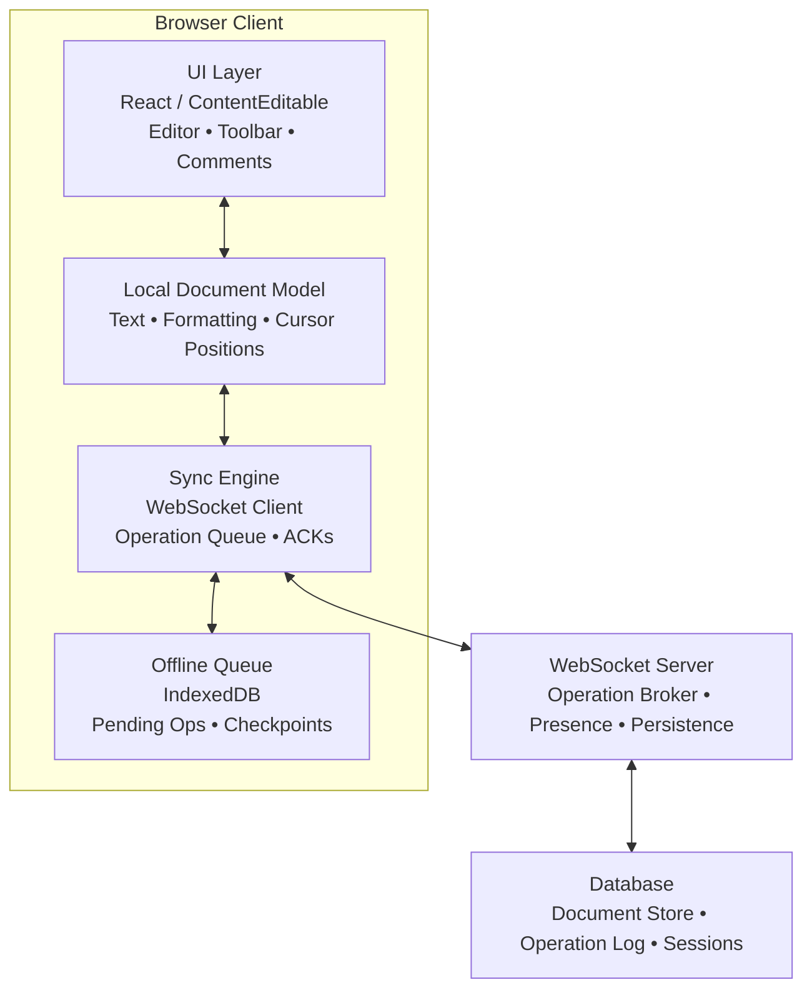

# 📝 System Design: Google Docs with Real-Time Collaboration (Frontend Interview Guide)

**Target Level:** Senior Frontend Engineer / Staff Engineer  
**Duration:** 45-60 minutes  
**Interview Focus:** Real-time Collaboration, Conflict Resolution, State Synchronization, Performance

> **Interview Importance:** 🔴 Critical — Collaborative editing questions test state synchronization, concurrency control, offline recovery, and product UX trade-offs all at once, which makes them a classic senior frontend design problem.

---

## Interview Approach & What Interviewers Look For

When asked to design Google Docs in a frontend interview, interviewers are evaluating:

1. **Real-time Collaboration:** Can you design a system where multiple users can edit simultaneously without conflicts?
2. **Conflict Resolution:** Do you understand Operational Transformation (OT) or CRDTs?
3. **State Management:** How do you keep local and remote state synchronized?
4. **Performance:** Can you handle large documents (100k+ characters) without lag?
5. **Offline Support:** How do you queue changes when the user is offline?
6. **Scalability:** Can your design support 50+ concurrent editors?

**Pro Tip:** Start by clarifying the scope, then dive into the collaborative editing algorithm (OT/CRDT), followed by architecture and implementation details.

---

## 1️⃣ Clarifying Questions (First 5 minutes)

Before diving in, ask these questions to scope the problem:

**Functional Scope:**
- "Should we support just text editing, or also rich formatting (bold, italics, images)?"
- "Do we need real-time cursor positions and presence indicators?"
- "Should we support comments and suggestions mode?"
- "Do we need version history and document recovery?"

**Non-Functional Requirements:**
- "How many concurrent users per document? 5? 50? 500?"
- "What's the target latency for edits to appear on other clients? <100ms?"
- "Should we support offline editing with sync when reconnected?"
- "What about conflict resolution when two users edit the same character?"

**Technical Constraints:**
- "Can we use WebSockets, or should we support HTTP-only environments?"
- "Browser support? Modern browsers only?"
- "Should we persist every keystroke, or batch updates?"

---

## 📈 Progressive Complexity Path

- **🟢 Junior:** Define the editor surface, local document model, and why real-time sync cannot rely on page refreshes.
- **🟡 Senior:** Explain OT/CRDT trade-offs, pending operation queues, presence, and offline persistence.
- **🔴 Staff:** Cover conflict resolution at scale, operational telemetry, recovery workflows, and how to keep large collaborative documents responsive.

---

## 2️⃣ High-Level Architecture (Draw This!)



**Key Talking Points:**
- **Separation of Concerns:** UI rendering is separate from document model and sync logic
- **Optimistic Updates:** Show changes immediately, reconcile in background
- **Event-Driven:** WebSocket pushes changes to all connected clients
- **Persistence:** Both client-side (IndexedDB) and server-side (Database)

---

## 3️⃣ Core Technical Decisions

### 3.1 Collaborative Editing: Operational Transformation (OT) vs CRDT

**Interview Answer:**
> "For real-time collaboration, we need to handle concurrent edits from multiple users. There are two main approaches:
>
> **Operational Transformation (OT):**
> - ✅ Smaller bandwidth (sends operations, not full state)
> - ✅ Google Docs uses this
> - ❌ Complex: requires transform functions for every operation pair
> - ❌ Central server required for operation ordering
>
> **Conflict-Free Replicated Data Types (CRDT):**
> - ✅ Simpler: mathematically proven to converge
> - ✅ Works peer-to-peer (no central server)
> - ✅ Better offline support
> - ❌ Larger payload size (contains metadata)
> - ❌ Examples: Yjs, Automerge
>
> For Google Docs scale, I'd use **OT** since it's bandwidth-efficient and we have a central server anyway."

### 3.2 Operational Transformation Explained

**Interview Answer:**
> "OT transforms operations so they can be applied in any order and still converge to the same result. Here's a simple example:
>
> **Initial state:** `'Hello'`
>
> **User A:** Inserts `'!'` at position 5 -> `'Hello!'`
> **User B:** Inserts `'World'` at position 5 -> `'HelloWorld'`
>
> When User A receives User B's operation:
> - Original operation: Insert 'World' at position 5
> - **Transform:** Since User A already inserted at position 5, we need to shift User B's operation
> - **Transformed operation:** Insert 'World' at position 6
> - **Final state:** `'Hello!World'`
>
> Both users converge to the same state regardless of operation order."

**Code Example:**
```javascript
class Operation {
  constructor(type, position, content) {
    this.type = type; // 'insert' or 'delete'
    this.position = position;
    this.content = content;
    this.clientId = null;
    this.version = null;
    this.id = Math.random().toString(36).slice(2, 11); // Unique operation ID
  }
}

// Transform operation B against operation A
// Returns the transformed version of opB that accounts for opA being applied first
const transform = (opA, opB) => {
  if (opA.type === 'insert' && opB.type === 'insert') {
    if (opA.position < opB.position) {
      // A inserts before B, shift B's position right
      return new Operation(
        opB.type,
        opB.position + opA.content.length,
        opB.content
      );
    } else if (opA.position > opB.position) {
      // A inserts after B, B is unaffected
      return opB;
    } else {
      // Same position - use client ID for deterministic ordering
      if (opA.clientId < opB.clientId) {
        return new Operation(
          opB.type,
          opB.position + opA.content.length,
          opB.content
        );
      }
      return opB;
    }
  }
  
  if (opA.type === 'delete' && opB.type === 'insert') {
    if (opB.position <= opA.position) {
      // B inserts before deletion, B is unaffected
      return opB;
    } else if (opB.position >= opA.position + opA.content.length) {
      // B inserts after deletion, shift B's position left
      return new Operation(
        opB.type,
        opB.position - opA.content.length,
        opB.content
      );
    } else {
      // B inserts within deleted range, adjust to deletion point
      return new Operation(
        opB.type,
        opA.position,
        opB.content
      );
    }
  }
  
  // Add more cases for delete-delete, etc.
  return opB;
};
```

### 3.3 Document Model: ContentEditable vs Custom Rendering

**Interview Answer:**
> "We have two options for rendering:
>
> **ContentEditable (Browser Native):**
> - ✅ Built-in cursor, selection, input handling
> - ✅ Accessibility for free
> - ❌ Inconsistent across browsers
> - ❌ Hard to control (browser can insert `<span>`, `<div>`, etc.)
> - ❌ Difficult to reconcile with our document model
>
> **Custom Canvas Rendering:**
> - ✅ Complete control over rendering
> - ✅ Consistent across browsers
> - ❌ Must implement cursor, selection, IME from scratch
> - ❌ Accessibility is complex
>
> Google Docs uses a **hybrid approach**: ContentEditable for input capture, but the visual rendering is custom. They intercept mutations and convert to operations, then re-render from the document model."

**Code Example:**
```javascript
class DocumentModel {
  constructor(initialText = '') {
    this.content = initialText;
    this.operations = []; // Operation log for OT
    this.version = 0;
    this.cursors = new Map(); // clientId -> position
  }
  
  applyOperation(operation) {
    switch(operation.type) {
      case 'insert':
        this.content = 
          this.content.slice(0, operation.position) +
          operation.content +
          this.content.slice(operation.position);
        break;
        
      case 'delete':
        this.content = 
          this.content.slice(0, operation.position) +
          this.content.slice(operation.position + operation.content.length);
        break;
    }
    
    this.operations.push(operation);
    this.version++;
  }
  
  getOperationsSince(version) {
    return this.operations.slice(version);
  }
}

// Example usage
const doc = new DocumentModel('Hello');

// Local user types
const op1 = new Operation('insert', 5, ' World');
doc.applyOperation(op1);
console.log(doc.content); // 'Hello World'

// Remote user's operation arrives
const op2 = new Operation('insert', 0, 'Say ');
doc.applyOperation(op2);
console.log(doc.content); // 'Say Hello World'
```

---

## 4️⃣ Real-Time Synchronization Architecture

### 4.1 WebSocket Communication Protocol

**Interview Answer:**
> "We need a reliable protocol for sending operations between clients and server:
>
> **Message Types:**
> 1. `OPERATION` - Client sends edit operation
> 2. `OPERATION_ACK` - Server acknowledges receipt (with server version)
> 3. `OPERATION_BROADCAST` - Server sends operation to other clients
> 4. `CURSOR_UPDATE` - Client sends cursor position
> 5. `PRESENCE_JOIN` - User joins document
> 6. `PRESENCE_LEAVE` - User leaves document
> 7. `SNAPSHOT` - Full document state (for new clients)
>
> **Flow:**
> 1. Client makes local edit -> Apply optimistically
> 2. Send operation to server via WebSocket
> 3. Server receives -> Transform against concurrent operations -> Persist -> Broadcast
> 4. Other clients receive -> Transform against local pending operations -> Apply
> 5. Original client receives ACK -> Commit operation (remove from pending queue)"

**Code Example:**
```javascript
class SyncEngine {
  constructor(documentId, userId) {
    this.documentId = documentId;
    this.userId = userId;
    this.ws = null;
    this.doc = new DocumentModel();
    this.pendingOps = []; // Operations not yet acknowledged
    this.serverVersion = 0;
    this.reconnectAttempts = 0;
  }
  
  connect() {
    this.ws = new WebSocket(`wss://api.example.com/docs/${this.documentId}`);
    
    this.ws.onopen = () => {
      console.log('Connected to document');
      this.reconnectAttempts = 0;
      
      // Request initial snapshot
      this.ws.send(JSON.stringify({
        type: 'SNAPSHOT_REQUEST',
        version: this.serverVersion
      }));
    };
    
    this.ws.onmessage = (event) => {
      const message = JSON.parse(event.data);
      this.handleMessage(message);
    };
    
    this.ws.onerror = (error) => {
      console.error('WebSocket error:', error);
    };
    
    this.ws.onclose = () => {
      console.log('Disconnected from document');
      this.reconnect();
    };
  }
  
  handleMessage(message) {
    switch(message.type) {
      case 'SNAPSHOT':
        this.doc = new DocumentModel(message.content);
        this.serverVersion = message.version;
        this.renderDocument();
        break;
        
      case 'OPERATION_BROADCAST':
        this.handleRemoteOperation(message.operation);
        break;
        
      case 'OPERATION_ACK':
        this.handleAcknowledgement(message);
        break;
        
      case 'CURSOR_UPDATE':
        this.updateRemoteCursor(message.clientId, message.position);
        break;
        
      case 'PRESENCE_JOIN':
        this.handleUserJoin(message.user);
        break;
        
      case 'PRESENCE_LEAVE':
        this.handleUserLeave(message.userId);
        break;
    }
  }
  
  // User makes local edit
  handleLocalOperation(operation) {
    // 1. Apply optimistically to local document
    this.doc.applyOperation(operation);
    this.renderDocument();
    
    // 2. Add to pending queue
    operation.clientId = this.userId;
    operation.baseVersion = this.serverVersion;
    this.pendingOps.push(operation);
    
    // 3. Send to server
    if (this.ws.readyState === WebSocket.OPEN) {
      this.ws.send(JSON.stringify({
        type: 'OPERATION',
        operation: operation
      }));
    } else {
      // Offline - will sync when reconnected
      this.saveToOfflineQueue(operation);
    }
  }
  
  // Server broadcasts another user's operation
  handleRemoteOperation(operation) {
    // Transform against all pending local operations
    let transformed = operation;
    for (const pendingOp of this.pendingOps) {
      transformed = transform(pendingOp, transformed);
    }
    
    // Apply transformed operation
    this.doc.applyOperation(transformed);
    this.serverVersion++;
    this.renderDocument();
  }
  
  // Server acknowledges our operation
  handleAcknowledgement(message) {
    const { operationId, version } = message;
    
    // Remove from pending queue
    this.pendingOps = this.pendingOps.filter(
      op => op.id !== operationId
    );
    
    this.serverVersion = version;
  }
  
  reconnect() {
    this.reconnectAttempts++;
    const delay = Math.min(1000 * Math.pow(2, this.reconnectAttempts), 30000);
    
    console.log(`Reconnecting in ${delay}ms...`);
    setTimeout(() => this.connect(), delay);
  }
  
  renderDocument() {
    // Update editor display (implementation depends on UI framework)
    document.getElementById('editor').textContent = this.doc.content;
  }
  
  async getDB() {
    // Initialize and return IndexedDB connection
    if (this.db) return this.db;
    
    return new Promise((resolve, reject) => {
      const request = indexedDB.open('GoogleDocsOffline', 1);
      
      request.onerror = () => reject(request.error);
      request.onsuccess = () => {
        this.db = request.result;
        resolve(this.db);
      };
      
      request.onupgradeneeded = (event) => {
        const db = event.target.result;
        if (!db.objectStoreNames.contains('operations')) {
          db.createObjectStore('operations', { autoIncrement: true });
        }
      };
    });
  }
  
  async saveToOfflineQueue(operation) {
    // Store in IndexedDB for offline support
    const db = await this.getDB();
    const tx = db.transaction(['operations'], 'readwrite');
    tx.objectStore('operations').add({
      documentId: this.documentId,
      operation: operation,
      timestamp: Date.now()
    });
  }
}
```

---

## 5️⃣ Common Interview Questions

### Q1: When would you choose OT instead of CRDT for collaborative text editing?

**Answer:** Choose OT when you have a central coordination server, want smaller payloads, and need predictable ordering for large collaborative documents. CRDT is attractive when offline-first or peer-to-peer collaboration is the primary requirement, but it usually carries more metadata overhead.

### Q2: How do you stop local typing from feeling laggy during poor network conditions?

**Answer:** Apply operations optimistically to the local model, queue them for sync, and reconcile later with ACKs plus transformation against remote operations. That keeps keystrokes immediate while preserving convergence once the server catches up.

### Q3: What breaks first when the document becomes very large?

**Answer:** Rendering and cursor bookkeeping usually break before the sync algorithm does. You need virtualization, incremental layout work, and careful presence updates so the editor stays responsive even when the operation log keeps growing.

---

## 🔍 Summary & Key Takeaways

**What to emphasize:**
1. ✅ **Collaborative editing algorithm:** Deep understanding of OT or CRDT
2. ✅ **Real-time sync:** WebSocket communication patterns
3. ✅ **Conflict resolution:** How to handle concurrent edits
4. ✅ **Performance:** Large document handling, batching, virtualization
5. ✅ **Offline support:** Queue operations, sync on reconnect
6. ✅ **User experience:** Cursor synchronization, presence, smooth editing

**What to avoid:**
1. ❌ Ignoring conflict resolution (biggest pitfall)
2. ❌ Not discussing OT/CRDT tradeoffs
3. ❌ Forgetting offline scenarios
4. ❌ Overlooking security (XSS, permissions)
5. ❌ Not considering performance at scale
6. ❌ Missing presence/awareness features

**Sample closing statement:**
> "To summarize, I'd build a real-time collaborative editor using Operational Transformation for conflict-free editing, WebSocket for low-latency synchronization, and IndexedDB for offline support. The key challenges are maintaining consistency across clients, handling network partitions, and optimizing performance for large documents. I'd use virtualization for rendering, batching for network efficiency, and comprehensive monitoring to ensure <100ms sync latency. The architecture separates UI, document model, and sync engine for maintainability."

---

## 6️⃣ Common Pitfalls

1. ❌ Relying on last-write-wins without a real transform or merge strategy.
2. ❌ Treating WebSocket disconnects as rare instead of designing for offline queues and replay.
3. ❌ Re-rendering the full document on every remote operation instead of batching or virtualizing updates.
4. ❌ Forgetting presence, permissions, and XSS concerns when rendering collaborative rich text.

---

## ⏱️ Complexity Summary

| Operation | Time Complexity | Space Complexity | Why it matters |
|---|---|---|---|
| Apply local insert/delete | `O(n)` | `O(n)` | Array or string-backed editors shift content as document size grows |
| Transform remote op against pending ops | `O(p)` | `O(p)` | `p` is the count of unacknowledged local operations |
| Rebuild visible editor slice | `O(v)` | `O(v)` | Virtualization keeps work proportional to visible content instead of full document size |
| Replay offline queue | `O(q)` | `O(q)` | Sync cost grows with queued operations after reconnect |

---

## 📚 Further Reading

- **Libraries:**
  - [Yjs](https://github.com/yjs/yjs) - CRDT implementation
  - [ShareDB](https://github.com/share/sharedb) - OT framework
  - [ProseMirror](https://prosemirror.net/) - Rich text editor with collaborative editing support
  - [Quill](https://quilljs.com/) - Rich text editor
  - [Slate.js](https://www.slatejs.org/) - Customizable rich text framework

- **Papers:**
  - "Operational Transformation in Real-Time Group Editors" (Ellis & Gibbs, 1989)
  - "A Comprehensive Study of Convergent and Commutative Replicated Data Types" (Shapiro et al., 2011)

- **Open Source Examples:**
  - [Firepad](https://github.com/FirebaseExtended/firepad) - Collaborative text editor using Firebase
  - [Etherpad](https://github.com/ether/etherpad-lite) - Real-time collaborative editor

---

**Pro Tips for the Interview:**
- Draw diagrams! Visual representation of OT/CRDT concepts helps interviewers follow your thought process
- Walk through concrete examples (e.g., "User A types 'X' at position 5 while User B deletes characters 3-7")
- Discuss tradeoffs explicitly (e.g., "OT has lower bandwidth but higher complexity")
- Mention real-world products (Google Docs uses OT, Notion uses CRDT)
- Be prepared to implement a simple OT transform function on a whiteboard

Good luck with your interview! 🚀

---

<!-- quiz-start -->
### Q1: What is the main purpose of Operational Transformation (OT) in collaborative editing?
- [ ] To compress document content for faster transmission
- [ ] To encrypt messages between clients
- [x] To transform operations so concurrent edits from multiple users converge to the same result
- [ ] To store document history in the database

### Q2: In OT, if User A inserts 'X' at position 5 and User B inserts 'Y' at position 5, how is the conflict resolved?
- [ ] User B's operation is discarded
- [ ] Both operations are rejected
- [x] One operation is transformed to adjust its position based on a deterministic rule (like client ID comparison)
- [ ] The server picks a random winner

### Q3: What is the key difference between OT and CRDT for collaborative editing?
- [ ] OT works offline, CRDT requires constant connection
- [x] OT requires a central server for ordering, while CRDT can work peer-to-peer and is mathematically proven to converge
- [ ] CRDT is more bandwidth-efficient than OT
- [ ] OT only supports text, CRDT supports all data types
<!-- quiz-end -->
