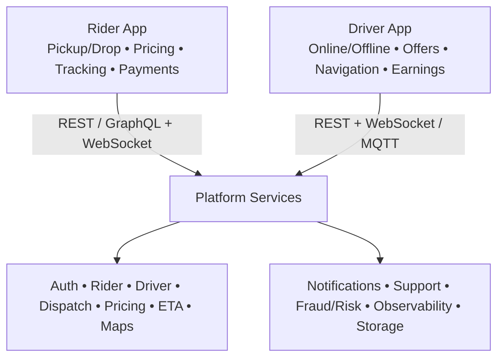
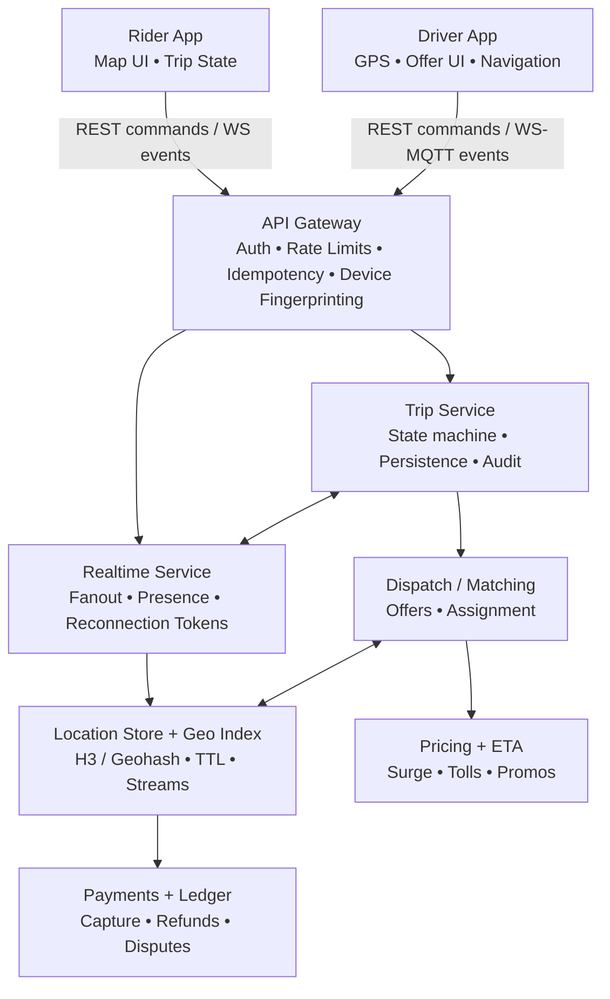
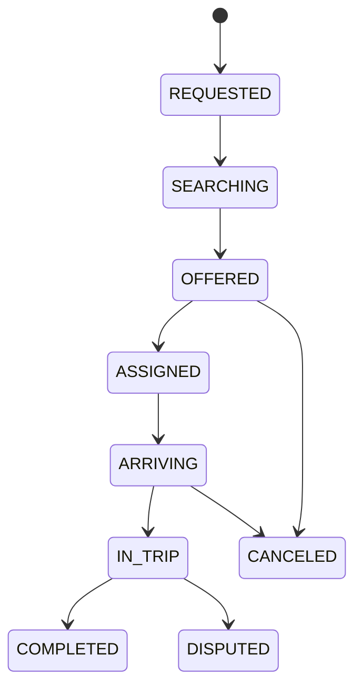

# 🚗 System Design: Ride-Hailing App (Uber/Ola)

**Target Level:** Senior Frontend Engineer / Staff Engineer  
**Duration:** 45-60 minutes  
**Interview Focus:** Real-Time Systems, Maps UX, High-Frequency Updates, Reliability, Privacy

> **Interview Importance:** 🔴 Critical — Ride-hailing combines real-time location, geo queries, map rendering, payments, and failure handling. Interviewers use it to test trade-offs across product UX and distributed systems.

---

## Interview Approach & What Interviewers Look For

When asked to design Uber/Ola, interviewers are evaluating:

1. **Scope control:** Can you clarify rider vs driver apps and keep the design coherent?
2. **Real-time thinking:** How you model location updates, ETAs, and state transitions.
3. **Geo + maps fundamentals:** Nearest-driver search, map rendering performance, and precision.
4. **Reliability:** Network loss, partial failures, retries, idempotency, and consistency.
5. **Security & privacy:** Location data handling, abuse prevention, and PII boundaries.

---

## 1️⃣ Clarifying Questions (First 5 minutes)

**Product scope**
- Rider app only, driver app only, or both?
- Immediate rides only, or scheduled rides too?
- Multiple ride types (bike/auto/car), pooling, deliveries?

**Scale**
- DAU/MAU? Peak QPS for “request ride” and location updates?
- City-level launch vs multi-country (different payment providers, maps, compliance)?

**UX constraints**
- ETA accuracy expectations (±1 min? ±30s?)
- Live driver movement smoothness (update every 1s? 2s? 5s?)
- Map provider constraints (Google Maps/Mapbox), offline needs?

**Non-functional**
- Fraud/abuse needs (fake GPS, account sharing)?
- Battery/data constraints on mobile?
- Regulatory constraints (location retention, consent, right-to-delete)?

---

## 2️⃣ What Are We Building?

Two client apps (often separate codebases) plus an admin/ops console:

1. **Rider app:** pickup/drop selection, pricing estimate, request ride, track driver, pay, support.
2. **Driver app:** go online, accept/decline, navigation, earnings, safety tools.
3. **Ops/Support:** trip audit, refunds, fraud signals, incident tools.

### Visual Model



---

## 3️⃣ Requirements

### Functional
- Request ride with pickup/drop and ride type.
- Match with a nearby available driver and send an offer.
- Live tracking (driver + trip state), dynamic ETA updates.
- Payments (cash/card/wallet), receipts, ratings, support flows.
- Cancellations with policies.

### Non-Functional
- **Low latency:** driver offers within ~1-3s in dense areas.
- **High availability:** graceful degradation (fallbacks when real-time fails).
- **Correctness:** no double-assigning drivers; idempotent state changes.
- **Privacy:** minimize and protect location retention; explicit consent.

---

## 4️⃣ High-Level Architecture (Draw This)



**Key idea:** Treat the system as **commands + events**.
- Commands: “request ride”, “accept offer”, “cancel trip”.
- Events: “offer sent”, “driver arrived”, “trip started”, “location updated”.

---

## 5️⃣ Core Data Model (Simplified)

**Entities**
- `Rider(id, profile, payment_methods, risk_flags)`
- `Driver(id, vehicle, status, last_location, last_seen_at)`
- `Trip(id, rider_id, driver_id?, status, pickup, drop, fare_quote_id)`
- `Offer(id, trip_id, driver_id, status, expires_at)`

**Trip state machine (must be strict)**



---

## 6️⃣ Matching & Dispatch (The Hard Part)

### 6.1 How to find nearby drivers

Common approaches:

| Approach | How it works | Pros | Cons |
|---|---|---|---|
| GeoHash grid | bucket drivers by GeoHash prefix | simple | uneven cell sizes near poles |
| H3 (hex grid) | bucket by hex cells | consistent neighbor traversal | extra dependency/learning |
| R-Tree / KD-Tree | spatial index | accurate | harder to scale under high churn |

Typical strategy:
1. Put drivers into **cells** (H3/GeoHash) with a short **TTL** (e.g., 10-30s).
2. For a pickup point, search **ring 0, ring 1, ring 2...** until enough candidates.
3. Rank candidates (distance + ETA + driver score + cancellation rate).

### 6.2 Offer flow

- Create trip in `SEARCHING`.
- Compute candidate drivers.
- Send **offer** to top N drivers (often sequential or small batches) with expiry (e.g., 10-15s).
- First accept wins; remaining offers get revoked.

### 🔍 Dry Run (Offer to assignment)

```text
Scenario: Rider requests a ride at (12.9716, 77.5946)
─────────────────────────────────────────────────────────
Step 1: Trip created
  trip.status = SEARCHING
  pickup_cell = h3(pickup)

Step 2: Candidate search
  ring = 0 -> drivers = 2
  ring = 1 -> drivers = 7 (total 9)
  Action: rank top 5 by ETA + distance + driver_score

Step 3: Offer batch
  send offers to drivers [D7, D3]
  offer.expires_in = 12s

Step 4: Accept arrives
  D3 accepts with idempotency_key = K1
  Condition: trip.status must still be SEARCHING/OFFERED
  Action: assign driver, revoke others, trip.status = ASSIGNED
```

---

## 7️⃣ Real-Time: Location, ETA, and State Updates

### 7.1 Update frequency (practical numbers)

- Driver GPS upload: **1-3s** when active trip, **5-10s** when idle/online.
- Rider map animation: render at **60fps**, but **snap network updates** to 1-2s and interpolate.

### 7.2 WebSocket vs SSE vs Polling

| Method | Best for | Notes |
|---|---|---|
| WebSocket | bidirectional real-time | great for trip state + presence |
| SSE | server → client events | simpler than WS, no upstream |
| Polling | fallback | use exponential backoff + cache |

### 7.3 Frontend pattern: realtime channel with backoff

```javascript
const createBackoff = ({ minMs = 250, maxMs = 10_000 } = {}) => {
  let attempt = 0;
  return () => {
    const jitter = Math.random() * 150;
    const ms = Math.min(maxMs, minMs * 2 ** attempt) + jitter;
    attempt += 1;
    return Math.floor(ms);
  };
};

export const connectTripSocket = ({ tripId, token, onEvent }) => {
  if (!tripId) throw new Error('tripId is required');
  if (!token) throw new Error('token is required');
  if (typeof onEvent !== 'function') throw new Error('onEvent must be a function');

  const nextDelay = createBackoff();
  let ws;
  let closedByUser = false;

  const connect = () => {
    ws = new WebSocket(`wss://api.example.com/realtime?tripId=${encodeURIComponent(tripId)}&token=${encodeURIComponent(token)}`);

    ws.onmessage = (message) => {
      try {
        const event = JSON.parse(message.data);
        onEvent(event);
      } catch {
        // Ignore malformed events; telemetry can record this.
      }
    };

    ws.onclose = () => {
      if (closedByUser) return;
      setTimeout(connect, nextDelay());
    };
  };

  connect();

  return () => {
    closedByUser = true;
    ws?.close();
  };
};
```

### 7.4 Smoothing driver movement (interpolation)

Network updates arrive discretely, but you render smoothly by interpolating between points:

- Keep a buffer of the last 2 locations with timestamps.
- Render position at `now - renderLagMs` (e.g., 300-800ms).
- Interpolate with linear or spline; clamp sudden jumps (GPS drift).

---

## 8️⃣ Maps UX (Frontend Deep Dive)

### What to emphasize
- **Two pins problem:** pickup and drop selection, plus “current location” drift.
- **Route display:** polyline simplification for performance.
- **POI search:** debounced input + cached results.
- **Offline & weak network:** cached map tiles (if provider permits), cached recent places.

**Performance knobs**
- Virtualize heavy panels (ride options list) while map stays responsive.
- Use workers for polyline decoding and heavy geo transforms.
- Avoid frequent re-renders: isolate map layer from UI state changes.

---

## 9️⃣ Pricing, Payments, and Receipts (High-Level)

**Pricing**
- Quote is computed server-side (distance, time, surge, tolls, promos).
- Client treats quote as **opaque** and displays breakdown.
- Quote should be short-lived and signed to prevent tampering.

**Payments**
- Use a ledger model: `authorize -> capture -> finalize -> receipt`.
- Support retries and idempotency for “pay now” and “refund”.

---

## 🔟 Reliability, Security, and Abuse

### Reliability patterns
- **Idempotency keys** for state-changing APIs (`accept_offer`, `cancel_trip`).
- **Outbox pattern** for emitting events after DB commit.
- **Graceful degradation:** if realtime fails, fallback to polling trip status.

### Abuse considerations
- GPS spoof detection (impossible speed, repeated jumps, device signals).
- Driver “multi-apping” (rapid online/offline thrash) and offer farming.
- Rate limit location uploads; drop noisy updates.

### Privacy
- Minimize retention: store high precision only while active trip; downsample after.
- Separate PII from trip telemetry; encrypt at rest; strict access controls.

---

## 🔟 Common Interview Questions

### Q1: How do you prevent two drivers from being assigned to the same rider?

**Answer:** Put trip assignment behind a strict state transition with idempotency keys and a compare-and-set style write. The first valid acceptance moves the trip to `ASSIGNED`, and every later acceptance is rejected or converted into a revoke event.

### Q2: Why not stream every GPS point directly into the UI at raw frequency?

**Answer:** Raw GPS streams create battery, bandwidth, and rendering pressure. A better design is to sample network updates at a practical cadence, smooth them with interpolation, and isolate map rendering from the rest of the UI state.

### Q3: What is the right fallback when realtime channels fail mid-trip?

**Answer:** Degrade gracefully to polling plus cached trip state, keep commands idempotent, and resume the socket when connectivity returns. Riders should still see trip status even if high-frequency location updates become less precise.

---

## 1️⃣1️⃣ Common Pitfalls (What Interviewers Love)

1. ❌ Treating location updates as “best effort” without a state machine and fallbacks.
2. ❌ Re-rendering the entire map UI on every GPS tick (battery killer).
3. ❌ Not handling offer races (two drivers accept; rider sees duplicates).
4. ❌ Missing cancellation/payment idempotency (double charge / double refund).
5. ❌ Ignoring privacy boundaries for location data.

---

## 1️⃣2️⃣ Time & Space Complexity (Useful Callouts)

| Operation | Complexity | Notes |
|---|---:|---|
| Update driver location | `O(1)` | write to cell + TTL |
| Find candidates | `O(k + r)` | `k` drivers scanned across `r` rings/cells |
| Rank candidates | `O(k log k)` | sort by score/ETA |
| Offer fanout | `O(n)` | `n` targeted drivers |

---

## 🔍 Summary (What To Say At The End)

- Use a strict **trip state machine** with idempotent transitions.
- Model the platform as **commands + events**; push state via realtime channels.
- Use **cell-based geo indexing** (H3/GeoHash) with TTL for fast candidate search.
- Smooth UX by interpolating location updates and isolating map rendering from UI state.
- Plan for failure: fallbacks, retries, and privacy-first location handling.

---

## 📚 Further Reading

- [Uber Engineering: H3](https://www.uber.com/blog/h3/) — Why hex grids are useful for geospatial indexing at scale
- [MDN: WebSocket API](https://developer.mozilla.org/en-US/docs/Web/API/WebSockets_API) — Browser realtime transport fundamentals
- [Mapbox Docs](https://docs.mapbox.com/) — Practical guidance for maps UX, tiles, and performance
- Maps frontend design: [google-maps.md](./google-maps.md)
- Caching and API patterns: [api_integration_caching.md](./api_integration_caching.md)
- Reliability mindset for event delivery: [analytics_sdk.md](../machine-coding/analytics_sdk.md)
- Input performance patterns: [debounce.md](../js/utils/debounce.md)

---

<!-- quiz-start -->
### Q1: Why do ride-hailing systems typically use a geo grid (H3/GeoHash) for nearby-driver search?
- [ ] Because it guarantees perfect nearest-neighbor results without scanning
- [x] Because it buckets drivers into cells so you can expand search rings efficiently under high churn
- [ ] Because it removes the need for driver location updates
- [ ] Because it works only for small cities

### Q2: What is the most important correctness rule in the offer/accept flow?
- [ ] Offers should never expire
- [x] Trip state transitions must be idempotent and prevent double-assignment when multiple drivers accept
- [ ] The client should compute the final fare to reduce server load
- [ ] GPS updates must be sent every 100ms to ensure accuracy

### Q3: What’s a good frontend strategy for smooth driver movement on the map?
- [ ] Re-render the entire page on every GPS update
- [ ] Poll trip status once per minute to save battery
- [x] Interpolate between timestamped location updates and render with a small lag buffer
- [ ] Disable animation to avoid drift
<!-- quiz-end -->
