# 🔗 System Design: URL Shortener (Backend Deep Dive)

**Target Level:** Junior → Senior → Staff Engineer (Progressive Complexity)  
**Duration:** 45-75 minutes  
**Interview Focus:** Backend Architecture, Distributed Systems, Database Design, Caching, Analytics

> **Interview Importance:** 🔴 Critical — The URL shortener is the most-asked system design question. Interviewers use it to gauge your depth: can you go beyond "hash the URL" and discuss ID generation strategies, distributed coordination, cache invalidation, abuse prevention, and analytics at scale?

---

## 1️⃣ Clarifying Questions (First 5 minutes)

Before designing, scope the problem with these questions:

**Functional Requirements:**
- Should shortened URLs expire? (TTL-based, user-configured, or permanent?)
- Do we need custom aliases? (`short.ly/my-brand`)
- Analytics? (Click counts, geo, referrer, device breakdown?)
- User accounts? (Dashboard, link management, bulk creation?)

**Non-Functional Requirements:**
- Scale: How many URLs/day? (10M writes, 100M reads → 10:1 read-heavy)
- Latency: Redirect SLA? (< 50ms p99?)
- Availability: 99.99%? (Can we tolerate eventual consistency?)
- Durability: Is losing a mapping acceptable? (No — this is core data)

**Constraints:**
- Short code length? (7 chars base62 → 3.5 trillion combinations)
- Regulatory? (GDPR right-to-delete, DMCA takedowns?)

### Back-of-Envelope Estimation

| Metric | Value |
|--------|-------|
| New URLs/day | 10M |
| Reads/day | 100M (10:1 ratio) |
| Reads/sec (peak) | ~3,000 QPS (with 3× peak factor) |
| Writes/sec (peak) | ~300 QPS |
| Storage per URL | ~500 bytes (URL + metadata) |
| Storage/year | 10M × 365 × 500B ≈ **1.8 TB/year** |
| Short code length | 7 chars (base62) = 62⁷ ≈ 3.5 trillion |

---

## 2️⃣ Progressive Architecture Overview

We'll build this system in three stages, each adding the complexity you'd discuss at a corresponding seniority level.

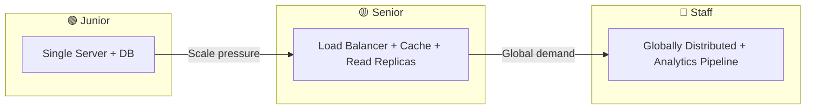

---

## 3️⃣ Stage 1: Junior Level — Single Server Design

### What We're Building

A working URL shortener on a single server. This proves you understand the core problem.

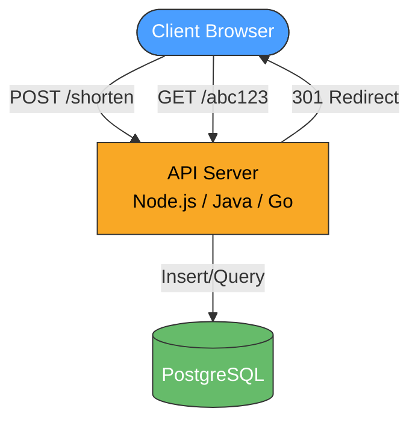

### Core API Design

```text
POST /api/v1/shorten
  Request:  { "long_url": "https://example.com/very-long-path", "custom_alias": "my-link" (optional), "ttl_days": 30 (optional) }
  Response: { "short_url": "https://short.ly/abc1234", "expires_at": "2026-07-21T00:00:00Z" }

GET /:shortCode
  Response: 301 Redirect → long_url
  Headers:  Location: https://example.com/very-long-path

GET /api/v1/stats/:shortCode
  Response: { "clicks": 1542, "created_at": "...", "expires_at": "..." }
```

### Database Schema (PostgreSQL)

```sql
CREATE TABLE urls (
    id              BIGINT PRIMARY KEY,           -- Snowflake ID (not auto-increment — we'll explain why)
    short_code      VARCHAR(10) UNIQUE NOT NULL,   -- The base62-encoded short code
    long_url        TEXT NOT NULL,                  -- Original URL
    custom_alias    VARCHAR(50) UNIQUE,             -- Optional user-chosen alias
    created_at      TIMESTAMPTZ DEFAULT NOW(),
    expires_at      TIMESTAMPTZ,                    -- NULL = never expires
    click_count     BIGINT DEFAULT 0,               -- Denormalized for quick reads
    user_id         BIGINT REFERENCES users(id),    -- NULL for anonymous
    is_active       BOOLEAN DEFAULT TRUE            -- Soft delete / abuse takedown
);

-- Index for the hot path: redirect lookup
CREATE INDEX idx_urls_short_code ON urls(short_code) WHERE is_active = TRUE;

-- Index for expiry cleanup
CREATE INDEX idx_urls_expires_at ON urls(expires_at) WHERE expires_at IS NOT NULL;
```

### Short Code Generation — Why Not Auto-Increment?

A naive approach: use `AUTO_INCREMENT` ID and base62 encode it.

```javascript
const BASE62 = '0123456789ABCDEFGHIJKLMNOPQRSTUVWXYZabcdefghijklmnopqrstuvwxyz';

const encodeBase62 = (num) => {
  if (num === 0) return BASE62[0];
  let result = '';
  while (num > 0) {
    result = BASE62[num % 62] + result;
    num = Math.floor(num / 62);
  }
  return result;
};

// ID 1000000 → "4c92"
// ID 3500000000000 → "ZZZZzzz" (7 chars)
```

**Problem with auto-increment:**

| Issue | Impact |
|-------|--------|
| Sequential = predictable | Attackers can enumerate all URLs |
| Single point of failure | DB is the only ID source |
| Cross-DB coordination | Multi-master needs sequence gaps |
| Information leakage | Competitors can estimate your volume |

### Solution: Snowflake IDs

Twitter's Snowflake algorithm generates unique, roughly-time-ordered, 64-bit IDs **without coordination**:

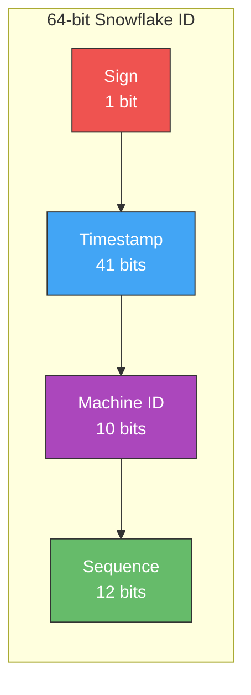

```
| 1 bit  |  41 bits timestamp  | 10 bits machine | 12 bits sequence |
|--------|---------------------|------------------|------------------|
| unused | ms since epoch      | 1024 machines    | 4096 IDs/ms/node |
```

**Why Snowflake is perfect for URL shorteners:**

| Property | Benefit |
|----------|---------|
| **Globally unique** | No coordination between servers needed |
| **Time-ordered** | Can sort by creation time without extra column |
| **Non-sequential** | Can't enumerate short codes by incrementing |
| **High throughput** | 4096 IDs per millisecond per machine |
| **64-bit** | Base62 encode → 11 chars max, we truncate/use lower bits for 7 chars |

```javascript
class SnowflakeGenerator {
  constructor(machineId) {
    this.machineId = machineId & 0x3FF; // 10 bits
    this.sequence = 0;
    this.lastTimestamp = -1;
    this.epoch = 1640995200000; // Custom epoch: 2022-01-01
  }

  nextId() {
    let timestamp = Date.now() - this.epoch;

    if (timestamp === this.lastTimestamp) {
      this.sequence = (this.sequence + 1) & 0xFFF; // 12 bits
      if (this.sequence === 0) {
        // Exhausted sequence for this ms — wait for next ms
        while (timestamp <= this.lastTimestamp) {
          timestamp = Date.now() - this.epoch;
        }
      }
    } else {
      this.sequence = 0;
    }

    this.lastTimestamp = timestamp;

    // Combine: timestamp (41 bits) | machineId (10 bits) | sequence (12 bits)
    return (BigInt(timestamp) << 22n) |
           (BigInt(this.machineId) << 12n) |
           BigInt(this.sequence);
  }
}

// Usage
const generator = new SnowflakeGenerator(1);
const id = generator.nextId();
const shortCode = encodeBase62(Number(id)).slice(-7); // Take last 7 chars
```

### 301 vs 302 Redirect — This Matters!

| Aspect | 301 (Permanent) | 302 (Temporary) |
|--------|-----------------|-----------------|
| **Browser caching** | Yes — browser skips our server next time | No — always hits our server |
| **SEO** | Passes link juice to destination | Keeps link juice on short URL |
| **Analytics accuracy** | ❌ Misses repeat visits | ✅ Captures every click |
| **Server load** | Lower (browser caches) | Higher (every request hits us) |

**Decision:** Use **302** if analytics matter (most products), **301** if you want to reduce server load and don't need click tracking.

### Junior-Level Summary

At this stage you've demonstrated:
- Clean API design with versioning
- Proper database schema with indexes for hot paths
- Understanding of why auto-increment is bad (security, distribution)
- Snowflake ID generation
- 301 vs 302 trade-off reasoning

---

## 4️⃣ Stage 2: Senior Level — Scaling for Production

### The Problem

Your single-server design hits limits:
- **Database is the bottleneck** — every redirect queries PostgreSQL
- **Single point of failure** — server goes down, everything goes down
- **No abuse protection** — bots can flood your service

### Scaled Architecture

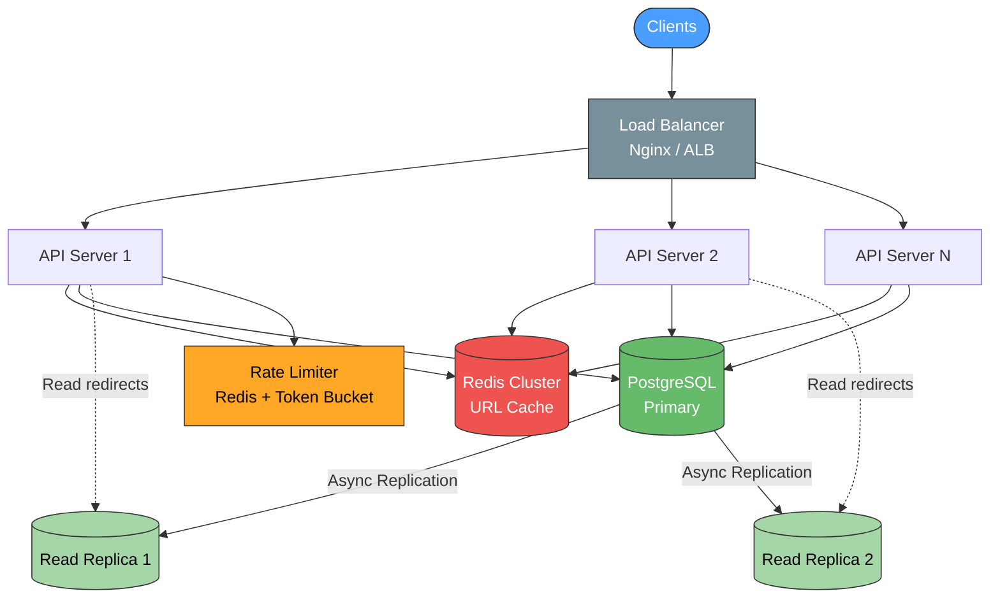

### Caching Strategy: Read-Through with Redis

Since redirects are 10× more frequent than creates, caching is the biggest win:

```javascript
const getRedirectUrl = async (shortCode) => {
  // 1. Check cache first (sub-millisecond)
  const cached = await redis.get(`url:${shortCode}`);
  if (cached) {
    // Async: increment click count (don't block redirect)
    clickQueue.push({ shortCode, timestamp: Date.now() });
    return cached;
  }

  // 2. Cache miss → query database
  const row = await db.query(
    'SELECT long_url, expires_at, is_active FROM urls WHERE short_code = $1',
    [shortCode]
  );

  if (!row || !row.is_active) return null;
  if (row.expires_at && new Date(row.expires_at) < new Date()) return null;

  // 3. Populate cache with TTL
  await redis.setex(`url:${shortCode}`, 86400, row.long_url); // 24h TTL

  clickQueue.push({ shortCode, timestamp: Date.now() });
  return row.long_url;
};
```

### Cache Invalidation — The Hard Part

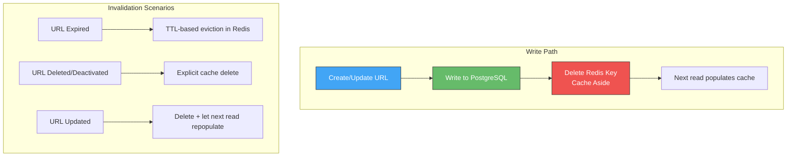

**Strategy: Cache-Aside (Lazy Loading)**
- **On write:** Delete from cache. Don't update — avoids race conditions.
- **On read:** If cache miss, read DB, populate cache.
- **TTL:** Set Redis TTL slightly shorter than URL expiry to auto-evict stale entries.

**Why not write-through?**

Write-through (update cache on every write) causes problems:
1. Race condition: Two concurrent updates → cache has stale data from the slower write
2. Wasted cache space: Many URLs are created but rarely accessed

### Rate Limiting

Protect against abuse with a Token Bucket algorithm:

```javascript
class TokenBucketRateLimiter {
  constructor(redis) {
    this.redis = redis;
  }

  async isAllowed(clientId, maxTokens = 100, refillRate = 10) {
    const key = `ratelimit:${clientId}`;
    const now = Date.now();

    const result = await this.redis.eval(`
      local key = KEYS[1]
      local max_tokens = tonumber(ARGV[1])
      local refill_rate = tonumber(ARGV[2])
      local now = tonumber(ARGV[3])

      local data = redis.call('HMGET', key, 'tokens', 'last_refill')
      local tokens = tonumber(data[1]) or max_tokens
      local last_refill = tonumber(data[2]) or now

      -- Refill tokens based on elapsed time
      local elapsed = (now - last_refill) / 1000
      tokens = math.min(max_tokens, tokens + elapsed * refill_rate)

      if tokens >= 1 then
        tokens = tokens - 1
        redis.call('HMSET', key, 'tokens', tokens, 'last_refill', now)
        redis.call('EXPIRE', key, 60)
        return 1
      else
        redis.call('HMSET', key, 'tokens', tokens, 'last_refill', now)
        redis.call('EXPIRE', key, 60)
        return 0
      end
    `, 1, key, maxTokens, refillRate, now);

    return result === 1;
  }
}
```

**Rate limit tiers:**

| Tier | Create URLs | Redirects | Identifier |
|------|-------------|-----------|------------|
| Anonymous | 10/hour | 1000/hour | IP address |
| Free user | 100/hour | 10,000/hour | User ID |
| Premium | 10,000/hour | Unlimited | API key |

### Handling Duplicate URLs

Should `shorten("https://example.com")` called twice return the same short code?

**Option A: Always create new** (Simple, LinkedIn does this)
- Pro: No lookup overhead on writes
- Con: Storage waste for popular URLs

**Option B: Deduplicate** (Bitly does this)
- Pro: Same URL → same short code (useful for caching)
- Con: Need hash index, extra read on write path

```sql
-- If deduplicating, add a hash column for O(1) lookup
ALTER TABLE urls ADD COLUMN url_hash BYTEA GENERATED ALWAYS AS (digest(long_url, 'sha256')) STORED;
CREATE INDEX idx_urls_url_hash ON urls(url_hash);

-- On create: check if URL already shortened
SELECT short_code FROM urls WHERE url_hash = digest($1, 'sha256') AND user_id = $2 AND is_active = TRUE;
```

### Database Read/Write Splitting

```javascript
const pool = {
  primary: new Pool({ host: 'primary.db.internal' }),
  replicas: [
    new Pool({ host: 'replica-1.db.internal' }),
    new Pool({ host: 'replica-2.db.internal' }),
  ],
  readIndex: 0,
};

const readQuery = async (sql, params) => {
  // Round-robin across replicas
  const replica = pool.replicas[pool.readIndex % pool.replicas.length];
  pool.readIndex++;
  return replica.query(sql, params);
};

const writeQuery = async (sql, params) => {
  return pool.primary.query(sql, params);
};
```

### Senior-Level Summary

At this stage you've added:
- Horizontal scaling with load balancer
- Redis caching with cache-aside strategy + invalidation
- Read replicas for database scaling
- Rate limiting with token bucket
- Duplicate URL handling strategy
- Read/write splitting

---

## 5️⃣ Stage 3: Staff Level — Globally Distributed System

### The Challenge

Your service is now global. Users in Tokyo experience 200ms+ latency hitting your US servers. You need:
- **Multi-region deployment** with low-latency redirects worldwide
- **Conflict-free ID generation** across data centers
- **Analytics pipeline** processing billions of events
- **Abuse detection** at scale

### Global Architecture

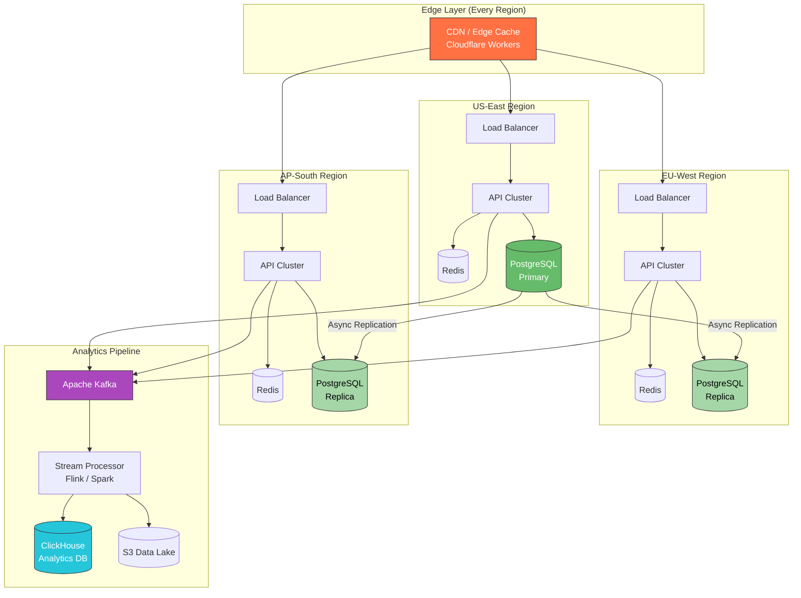

### Multi-Region ID Generation: Enhanced Snowflake

In a distributed setup, machine ID alone isn't enough. We embed the **data center ID**:

```
| 1 bit  | 41 bits timestamp | 5 bits DC | 5 bits machine | 12 bits sequence |
|--------|-------------------|-----------|----------------|------------------|
| unused | ms since epoch    | 32 DCs    | 32 per DC      | 4096/ms/machine  |
```

```javascript
class DistributedSnowflake {
  constructor(datacenterId, machineId) {
    this.datacenterId = datacenterId & 0x1F; // 5 bits → 32 data centers
    this.machineId = machineId & 0x1F;       // 5 bits → 32 machines per DC
    this.sequence = 0;
    this.lastTimestamp = -1n;
    this.epoch = 1640995200000n; // 2022-01-01
  }

  nextId() {
    let timestamp = BigInt(Date.now()) - this.epoch;

    if (timestamp === this.lastTimestamp) {
      this.sequence = (this.sequence + 1) & 0xFFF;
      if (this.sequence === 0) {
        while (timestamp <= this.lastTimestamp) {
          timestamp = BigInt(Date.now()) - this.epoch;
        }
      }
    } else {
      this.sequence = 0;
    }

    this.lastTimestamp = timestamp;

    return (timestamp << 22n) |
           (BigInt(this.datacenterId) << 17n) |
           (BigInt(this.machineId) << 12n) |
           BigInt(this.sequence);
  }
}

// DC=1, Machine=5 → uniquely identifies this node globally
const gen = new DistributedSnowflake(1, 5);
```

**Alternative: Pre-allocated ID Ranges**

For even higher throughput, each node can pre-allocate ID ranges from a central coordinator (like ZooKeeper):

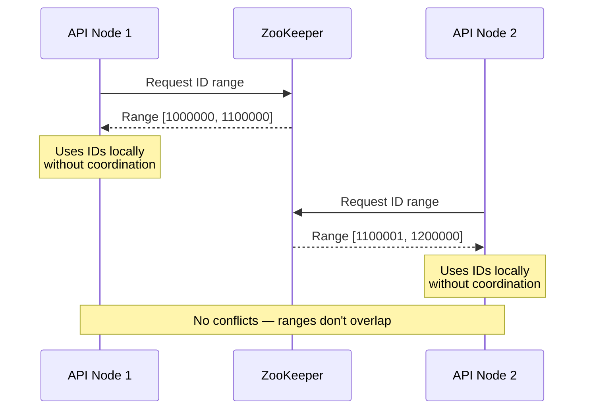

### Database Sharding Strategy

At 1.8 TB/year, a single PostgreSQL instance won't cut it forever. Shard by short code:

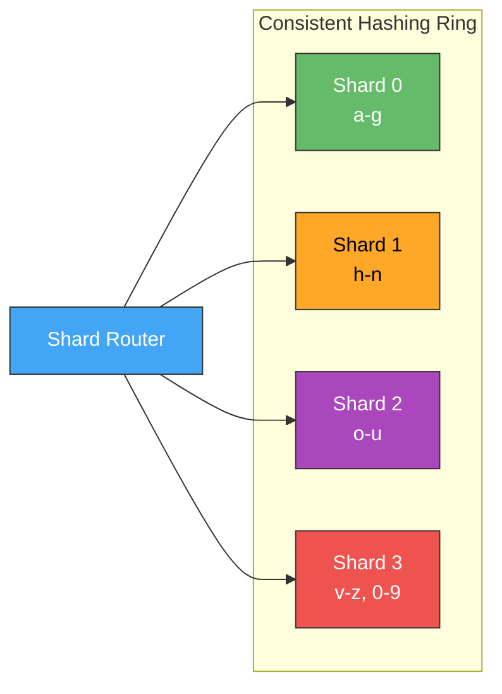

```javascript
const SHARD_COUNT = 4;

const getShardId = (shortCode) => {
  // Consistent hashing using the first char is naive but illustrative
  // Production: use MurmurHash or xxHash on the full short code
  const hash = murmurHash3(shortCode);
  return hash % SHARD_COUNT;
};

const getShardConnection = (shortCode) => {
  const shardId = getShardId(shortCode);
  return shardPools[shardId];
};

// Redirect lookup goes to exact shard
const redirect = async (shortCode) => {
  const pool = getShardConnection(shortCode);
  const row = await pool.query(
    'SELECT long_url FROM urls WHERE short_code = $1 AND is_active = TRUE',
    [shortCode]
  );
  return row?.long_url;
};
```

**Why consistent hashing over modulo?**

When you add a shard (4 → 5), modulo `hash % N` remaps ~80% of keys. Consistent hashing remaps only ~20% (K/N keys where K = total keys):

| Method | Adding 1 shard (4→5) | Keys remapped |
|--------|----------------------|---------------|
| Modulo | `hash % 5 ≠ hash % 4` | ~80% |
| Consistent hashing | Only keys between new node and its neighbor | ~20% |

### Edge Caching: Sub-10ms Redirects

Use Cloudflare Workers or AWS Lambda@Edge for redirect resolution at the edge:

```javascript
// Cloudflare Worker — runs at 300+ edge locations
export default {
  async fetch(request) {
    const url = new URL(request.url);
    const shortCode = url.pathname.slice(1);

    if (!shortCode || shortCode.includes('/')) {
      return fetch(request); // Proxy to origin for non-redirect routes
    }

    // Check edge KV store (replicated globally, ~10ms reads)
    const longUrl = await URLS_KV.get(shortCode);
    if (longUrl) {
      // Fire-and-forget analytics event
      waitUntil(logClick(shortCode, request));
      return Response.redirect(longUrl, 302);
    }

    // Cache miss → origin server
    const originResponse = await fetch(`https://api.short.ly/resolve/${shortCode}`);
    if (originResponse.ok) {
      const { long_url } = await originResponse.json();
      // Cache at edge for future requests
      waitUntil(URLS_KV.put(shortCode, long_url, { expirationTtl: 86400 }));
      return Response.redirect(long_url, 302);
    }

    return new Response('Not Found', { status: 404 });
  }
};
```

### Analytics Pipeline

Don't block redirects for analytics. Use an async event pipeline:

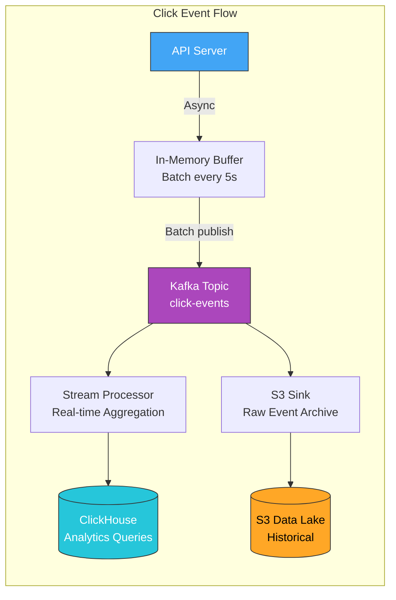

```javascript
// Click event schema
const clickEvent = {
  short_code: 'abc1234',
  timestamp: '2026-06-21T14:00:00Z',
  ip_hash: 'sha256(ip)', // Hashed for privacy
  country: 'IN',
  city: 'Mumbai',
  user_agent: 'Mozilla/5.0...',
  referrer: 'https://twitter.com',
  device_type: 'mobile',    // Parsed from UA
  os: 'iOS',
  browser: 'Safari',
};

// Batched producer — don't send one event at a time
class ClickEventProducer {
  constructor(kafka) {
    this.buffer = [];
    this.batchSize = 500;
    this.flushInterval = 5000; // 5 seconds

    setInterval(() => this.flush(), this.flushInterval);
  }

  push(event) {
    this.buffer.push(event);
    if (this.buffer.length >= this.batchSize) {
      this.flush();
    }
  }

  async flush() {
    if (this.buffer.length === 0) return;
    const batch = this.buffer.splice(0);

    try {
      await this.kafka.producer.send({
        topic: 'click-events',
        messages: batch.map(e => ({
          key: e.short_code,
          value: JSON.stringify(e),
        })),
      });
    } catch (err) {
      // Re-queue failed events (with retry limit)
      this.buffer.unshift(...batch);
      console.error('Kafka publish failed, will retry:', err);
    }
  }
}
```

### ClickHouse Schema for Analytics

```sql
CREATE TABLE click_events (
    short_code     String,
    timestamp      DateTime64(3, 'UTC'),
    country        LowCardinality(String),
    city           String,
    device_type    LowCardinality(Enum8('desktop'=1, 'mobile'=2, 'tablet'=3)),
    os             LowCardinality(String),
    browser        LowCardinality(String),
    referrer_domain String
) ENGINE = MergeTree()
PARTITION BY toYYYYMM(timestamp)
ORDER BY (short_code, timestamp);

-- Query: clicks per day for a short code
SELECT
    toDate(timestamp) AS day,
    count() AS clicks,
    uniqExact(country) AS unique_countries
FROM click_events
WHERE short_code = 'abc1234'
  AND timestamp >= now() - INTERVAL 30 DAY
GROUP BY day
ORDER BY day;
```

### Abuse Prevention at Scale

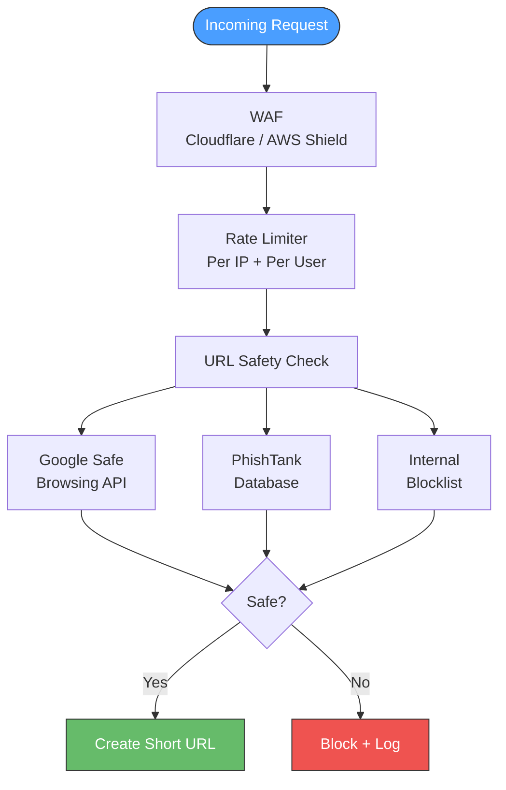

**Multi-layer protection:**

```javascript
class AbuseDetector {
  constructor() {
    this.blockedDomains = new BloomFilter(1_000_000); // Memory-efficient set
    this.suspiciousPatterns = [
      /\.(exe|bat|cmd|scr|pif)$/i,         // Executable files
      /^(data|javascript|vbscript):/i,      // Data URIs
      /@.*@/,                                // Email injection
    ];
  }

  async checkUrl(longUrl) {
    const url = new URL(longUrl);

    // Layer 1: Domain blocklist (O(1) via Bloom filter)
    if (this.blockedDomains.has(url.hostname)) {
      return { safe: false, reason: 'blocked_domain' };
    }

    // Layer 2: Pattern matching
    for (const pattern of this.suspiciousPatterns) {
      if (pattern.test(longUrl)) {
        return { safe: false, reason: 'suspicious_pattern' };
      }
    }

    // Layer 3: External API check (async, don't block if slow)
    try {
      const [googleResult, phishResult] = await Promise.allSettled([
        this.checkGoogleSafeBrowsing(longUrl),
        this.checkPhishTank(url.hostname),
      ]);

      if (googleResult.status === 'fulfilled' && !googleResult.value.safe) {
        return { safe: false, reason: 'google_safe_browsing' };
      }
      if (phishResult.status === 'fulfilled' && !phishResult.value.safe) {
        return { safe: false, reason: 'phishtank' };
      }
    } catch {
      // External check failed — allow but flag for review
      return { safe: true, flagged: true };
    }

    return { safe: true, flagged: false };
  }
}
```

### Consistency Model: Writes vs Reads

In a multi-region setup, you face the CAP theorem trade-off:

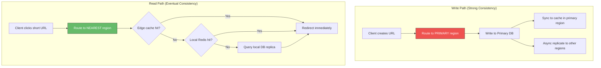

**Key insight:** A URL created in US-East might take 100-500ms to replicate to AP-South. If a user creates a URL and immediately shares it with someone in Asia, they might get a 404. Mitigations:

1. **Read-your-writes consistency:** After creating, return the short URL that routes to the primary region for the first few seconds
2. **Sticky sessions:** Route creator's first few requests to primary region
3. **Accept it:** For most use cases, 500ms delay is acceptable

### Handling Expired URLs

Don't delete immediately — use lazy + batch cleanup:

```javascript
// Lazy check on read (no extra query cost)
const redirect = async (shortCode) => {
  const url = await cache.get(shortCode) || await db.getUrl(shortCode);

  if (url && url.expires_at && new Date(url.expires_at) < new Date()) {
    // Expired — return 410 Gone (not 404)
    await cache.delete(shortCode);
    return { status: 410, message: 'This link has expired' };
  }

  return { status: 302, location: url.long_url };
};

// Batch cleanup cron job (runs every hour)
const cleanupExpiredUrls = async () => {
  const batchSize = 10000;

  while (true) {
    const result = await db.query(`
      UPDATE urls
      SET is_active = FALSE
      WHERE expires_at < NOW()
        AND is_active = TRUE
      LIMIT $1
      RETURNING short_code
    `, [batchSize]);

    // Invalidate cache for cleaned up URLs
    for (const row of result.rows) {
      await redis.del(`url:${row.short_code}`);
    }

    if (result.rows.length < batchSize) break; // Done
    await sleep(100); // Avoid overwhelming the DB
  }
};
```

---

## 6️⃣ Data Flow: Complete Request Lifecycle

### Write Path (Creating a Short URL)

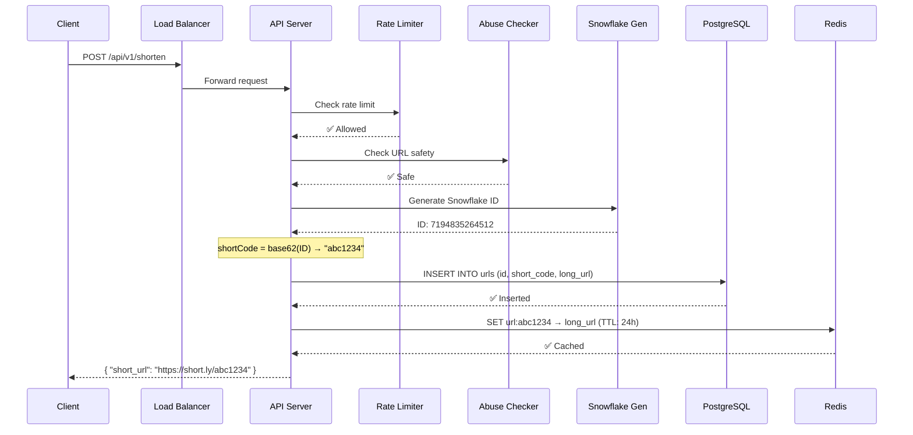

### Read Path (Redirecting)

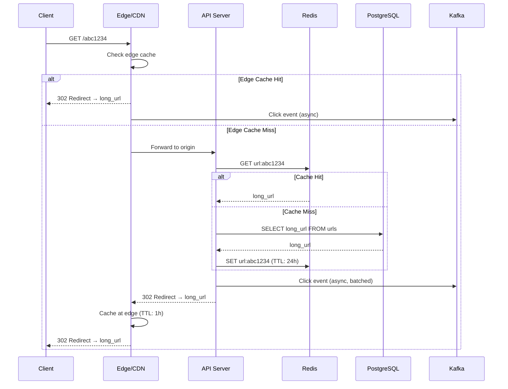

---

## 7️⃣ Key Trade-offs Summary

| Decision | Option A | Option B | Recommendation |
|----------|----------|----------|----------------|
| **ID Generation** | Auto-increment | Snowflake | Snowflake (distributed, non-sequential) |
| **Redirect Type** | 301 Permanent | 302 Temporary | 302 if analytics needed |
| **Cache Strategy** | Write-through | Cache-aside | Cache-aside (fewer race conditions) |
| **Duplicate URLs** | Always new code | Deduplicate | Depends on product (deduplicate for user-facing) |
| **Sharding Key** | short_code hash | user_id | short_code (matches access pattern) |
| **Analytics** | Sync (in request) | Async (Kafka) | Async (never block redirects) |
| **Consistency** | Strong (single region) | Eventual (multi-region) | Eventual for reads, strong for writes |
| **Expiry Cleanup** | On-read (lazy) | Batch cron | Both (lazy catches stragglers) |

---

## 8️⃣ Common Interview Questions

**Q1: What happens if two servers generate the same short code?**  
With Snowflake IDs, this is virtually impossible. Each server has a unique `(datacenter_id, machine_id)` pair, and the sequence counter handles same-millisecond collisions on the same machine. The probability of collision is effectively zero. As a safety net, the database has a UNIQUE constraint on `short_code` — a duplicate insert fails and we retry with a new ID.

**Q2: How do you handle a "hot" short URL (millions of clicks/minute)?**  
Layer the caching: Edge CDN (Cloudflare KV, 300+ locations) → Regional Redis → Database. The hot URL is served from edge cache 99.9% of the time. For analytics, batch click events in memory and flush to Kafka every few seconds — never do a DB write per click.

**Q3: How would you migrate from a single database to sharded?**  
Use a dual-write approach:
1. Set up shard databases
2. Start dual-writing (write to both old DB and correct shard)
3. Backfill historical data to shards
4. Verify consistency with checksums
5. Switch reads to shards
6. Stop writing to old DB
7. Decommission old DB

**Q4: What if Kafka goes down? Do we lose click data?**  
Use a local Write-Ahead Log (WAL). If Kafka publish fails, events are written to a local file. A recovery process replays the WAL when Kafka recovers. This gives at-least-once delivery. ClickHouse handles deduplication on the analytics side.

**Q5: How do you prevent someone from creating a short URL to a phishing site?**  
Multi-layer: Google Safe Browsing API check on create, periodic re-scanning of existing URLs, domain blocklist (Bloom filter for O(1) lookup), user reporting mechanism, and machine-learning anomaly detection on creation patterns (bulk creation from single IP, targeting similar domains).

**Q6: Custom aliases — how do you handle conflicts?**  
Check the `custom_alias` column (UNIQUE constraint). If taken, return a 409 Conflict with suggestion. For premium users, allow "reserving" aliases. Use a case-insensitive unique index to prevent `MyBrand` and `mybrand` conflicts.

---

## 9️⃣ Common Pitfalls

### ❌ Pitfall 1: Using MD5/SHA for Short Codes

```javascript
// ❌ BAD: Hash collisions + fixed output length
const shortCode = md5(longUrl).slice(0, 7);
// Different URLs can produce same 7-char prefix!
// Also: same URL always = same code (no user isolation)
```

```javascript
// ✅ GOOD: Snowflake ID + base62 encoding
const id = snowflake.nextId();
const shortCode = encodeBase62(id).padStart(7, '0');
// Guaranteed unique, non-predictable, no collisions
```

### ❌ Pitfall 2: Blocking Redirects for Analytics

```javascript
// ❌ BAD: Analytics write blocks the redirect
app.get('/:code', async (req, res) => {
  const url = await db.getUrl(req.params.code);
  await db.query('UPDATE urls SET click_count = click_count + 1 WHERE short_code = $1', [req.params.code]);
  await db.query('INSERT INTO click_events (...) VALUES (...)', [eventData]);
  res.redirect(302, url);  // User waits for ALL of this
});
```

```javascript
// ✅ GOOD: Fire-and-forget analytics
app.get('/:code', async (req, res) => {
  const url = await cache.get(req.params.code) || await db.getUrl(req.params.code);
  res.redirect(302, url);  // User redirected immediately

  // Analytics happens async — don't await
  clickProducer.push({
    short_code: req.params.code,
    timestamp: Date.now(),
    ip: req.ip,
    user_agent: req.headers['user-agent'],
  });
});
```

### ❌ Pitfall 3: No Graceful Degradation

```javascript
// ❌ BAD: Cache down = entire service down
const redirect = async (code) => {
  const url = await redis.get(`url:${code}`); // Throws if Redis is down
  return url;
};
```

```javascript
// ✅ GOOD: Fallback chain with circuit breaker
const redirect = async (code) => {
  try {
    const cached = await redis.get(`url:${code}`);
    if (cached) return cached;
  } catch (err) {
    // Redis down — log and continue to DB
    metrics.increment('cache.errors');
  }

  // Fallback to database
  const row = await db.query(
    'SELECT long_url FROM urls WHERE short_code = $1 AND is_active = TRUE',
    [code]
  );
  return row?.long_url || null;
};
```

---

## 🔟 Capacity & Complexity Summary

| Component | Time Complexity | Space Complexity |
|-----------|----------------|------------------|
| Snowflake ID generation | O(1) | O(1) per generator |
| Base62 encode/decode | O(log n) | O(log n) |
| Redis redirect lookup | O(1) | O(n) total keys |
| DB redirect lookup (indexed) | O(log n) B-tree | O(n) rows |
| Bloom filter (abuse check) | O(k) k = hash functions | O(m) bits |
| Consistent hash (shard routing) | O(log n) virtual nodes | O(n) ring entries |
| Kafka event publish (batched) | O(1) amortized | O(batch_size) buffer |

---

## 🔍 Summary

### Quick Reference

| Level | What You Add | Key Concepts |
|-------|-------------|--------------|
| 🟢 **Junior** | Single server + DB | API design, Snowflake IDs, base62, 301 vs 302 |
| 🟡 **Senior** | Caching + replicas + rate limiting | Cache-aside, token bucket, read/write split, deduplication |
| 🔴 **Staff** | Multi-region + analytics + abuse | Edge caching, consistent hashing, Kafka pipeline, CAP trade-offs |

### 5 Key Takeaways

1. **Snowflake IDs solve distributed uniqueness** — no coordination, no sequential leaks, 4K IDs/ms/node
2. **Cache-aside > write-through** for read-heavy workloads with low write frequency
3. **Never block redirects for analytics** — use async event pipelines (Kafka → ClickHouse)
4. **Edge caching is the ultimate scaling lever** — 300+ locations, sub-10ms redirects globally
5. **Defense in depth for abuse** — WAF → rate limiter → URL safety check → periodic re-scan

---

## 📚 Further Reading

- [Twitter Snowflake (archived)](https://blog.twitter.com/engineering/en_us/a/2010/announcing-snowflake) — Original Snowflake paper
- [Consistent Hashing — Stanford](https://web.stanford.edu/class/cs168/l/l1.pdf) — Academic deep dive
- [ClickHouse Documentation](https://clickhouse.com/docs) — Analytics database for event data
- [Cloudflare Workers KV](https://developers.cloudflare.com/workers/runtime-apis/kv/) — Edge key-value store

---

<!-- quiz-start -->
### Q1: Why is Snowflake ID preferred over auto-increment for URL shorteners?
- [ ] Snowflake IDs are shorter than auto-increment IDs
- [x] Snowflake IDs are globally unique without cross-server coordination and non-sequential
- [ ] Snowflake IDs are always faster to generate than auto-increment
- [ ] Auto-increment doesn't work with PostgreSQL

### Q2: In a read-heavy system (10:1 read-to-write), which caching strategy is most appropriate?
- [ ] Write-through cache (update cache on every write)
- [x] Cache-aside with lazy loading (populate cache on read miss)
- [ ] Write-behind cache (write to cache, async persist to DB)
- [ ] No caching — databases handle reads efficiently

### Q3: Why should analytics NOT be processed synchronously in the redirect path?
- [ ] Analytics data isn't important enough to process
- [ ] Synchronous processing is always slower than async
- [x] It adds latency to redirects and makes the service dependent on the analytics pipeline's availability
- [ ] Kafka requires async processing by design
<!-- quiz-end -->
